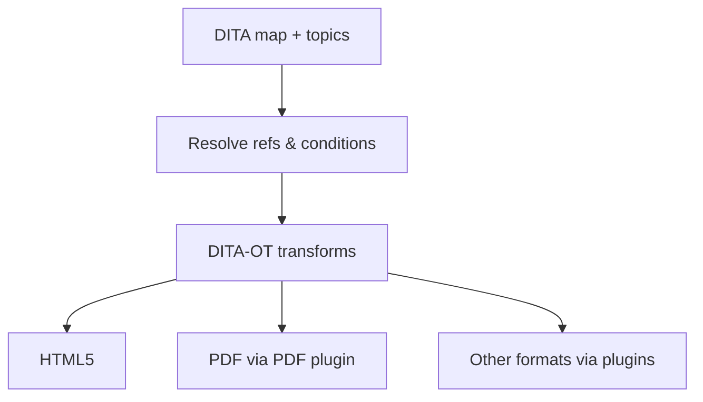

Behind many AEM Guides outputs sits the **DITA Open Toolkit (DITA-OT)**, the
open-source engine that transforms DITA into finished formats. Understanding its
role helps you know what's customizable, what plugins buy you, and when to reach
for Adobe's native PDF engine instead. This guide demystifies it.

## What the DITA-OT does

The DITA-OT takes your resolved DITA (topics assembled by a map, references
resolved, conditions applied) and transforms it into an output like HTML5 or PDF.

## Built-in vs custom DITA-OT

| Option | When to use |
| --- | --- |
| Built-in DITA-OT | Standard outputs; least maintenance |
| Custom DITA-OT | You need specific plugins, versions, or heavy customization |

AEM Guides ships with a DITA-OT and lets you register a **custom DITA-OT** when you
need particular plugins or transforms.

## Plugins extend the toolkit

DITA-OT is plugin-based. Plugins can add output formats, tweak transforms, or apply
custom styling. Because AEM Guides supports the standard toolkit, much of the
DITA-OT plugin ecosystem is available to you.

<strong>Trade-off:</strong> Standard DITA-OT gives you portability and community plugins; native PDF gives you modern, template-driven design control. Many teams use native PDF for print and DITA-OT for other formats.

## Native PDF as an alternative

For PDF specifically, Adobe's **native PDF** engine is a template-driven
alternative to the DITA-OT PDF plugin, offering richer, CSS-like styling and
faster design iteration. It does not replace the DITA-OT for other outputs, but
it's often the better choice for print-grade PDF.

The settings area where a custom DITA-OT can be registered for publishing.

## When to customize the toolkit

- You need an output format the defaults don't provide.
- You must match a strict corporate style the standard transforms can't produce.
- You depend on a specific DITA-OT version or community plugin.

If your needs are met by native PDF and the default HTML5, you may never need to
touch the toolkit, which is the low-maintenance happy path.

## Troubleshooting

- **A DITA-OT build fails.** Read the toolkit log top-down; the first real error
  (often a bad reference or invalid DITA) is usually the cause.
- **Custom plugin not picked up.** Confirm the custom DITA-OT is registered and the
  plugin is installed/integrated correctly.
- **Output differs from expected styling.** You may be using the DITA-OT PDF
  transform where you intended native PDF; check the preset's engine.

## Takeaway

The DITA-OT is the open-standard engine powering many AEM Guides outputs, extended
with Adobe's enhancements. Use the built-in toolkit for standard needs, register a
custom DITA-OT with plugins when you must, and prefer native PDF for print-grade
documents. You get open-standard flexibility without lock-in.
