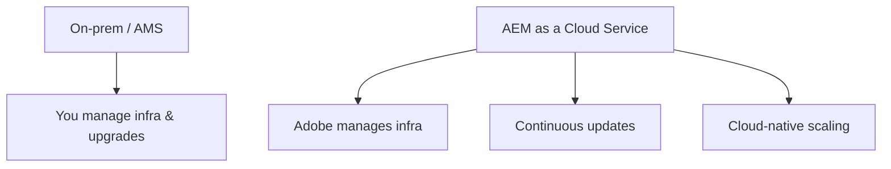

AEM Guides runs on AEM as a Cloud Service, and "the cloud version" is not just the
same product on someone else's servers. The operating model changes in ways that
affect how you configure, update, and scale. This guide covers what's different and
how to plan for it.

## The operating-model shift

| Dimension | Traditional AEM | AEM as a Cloud Service |
| --- | --- | --- |
| Infrastructure | You run and patch it | Adobe manages it |
| Upgrades | Periodic, planned projects | Continuous, incremental |
| Scaling | Provision manually | Elastic, cloud-native |
| Config delivery | Some runtime changes | Config-as-code via pipelines |

## Continuous updates change your rhythm

Instead of large, occasional upgrades, Cloud Service delivers **frequent
incremental updates**. Benefits: you're always current, with less big-bang upgrade
risk. Implication: design workflows and customizations to tolerate ongoing change
rather than freezing on a version.

<strong>Plan for evergreen:</strong> Favor supported extension points and configuration over deep, brittle customizations that continuous updates could disturb.

## Configuration differences

- Many settings move toward **config-as-code** deployed through Cloud Manager
  pipelines rather than ad-hoc runtime changes.
- OSGi and environment configuration follow Cloud Service conventions (for example,
  environment-specific values and secrets).
- Some traditional on-prem tuning knobs are replaced by managed equivalents.

A Cloud Manager pipeline deploying configuration to an AEM Guides Cloud Service environment.

## Publishing and scale

Cloud-native infrastructure means publishing and processing can **scale
elastically**, which helps large output jobs and busy teams. You spend less time on
capacity and more on content.

## What stays the same

The core authoring experience, DITA, the Web Editor, reuse, reviews, translation,
and output presets are the same skills. Your authoring knowledge transfers
directly; what changes is the operations and configuration model around it.

## Troubleshooting and adaptation

- **A customization broke after an update.** It likely relied on an unsupported
  internal; move to a supported extension point.
- **Config change didn't take.** On Cloud Service, deploy via the pipeline rather
  than expecting a runtime edit to persist.
- **Environment-specific values.** Use the Cloud Service mechanisms for
  per-environment config and secrets, not hard-coded values.
- **Unsure what's managed vs yours.** Adobe manages infrastructure and updates; you
  own content, configuration-as-code, and customizations.

## Takeaway

On AEM as a Cloud Service, Adobe runs the infrastructure and ships continuous
updates, and configuration leans toward config-as-code through pipelines. Your
authoring skills carry over unchanged; adapt your operations to an evergreen,
config-as-code model and you gain always-current software with less upgrade risk.
