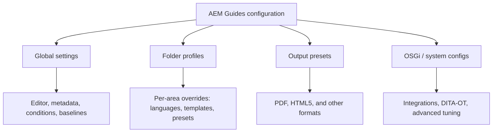

AEM Guides is highly configurable, which is a blessing once you know where each
setting lives and a maze until you do. This is a practical map of the main
configuration areas, grouped by what they affect, with a one-line explanation of
each. Exact labels shift slightly between releases, so treat this as a mental
model rather than a click-by-click script.

## Where configuration lives

Two ideas explain most of it: **global settings** define defaults for the whole
instance, and **folder profiles** override those defaults for a specific content
area. Publishing and system-level behavior sit alongside as presets and OSGi
configurations.

## 1. Profiles and scope

| Configuration | What it controls |
| --- | --- |
| Global profile | Instance-wide defaults for editing, metadata, conditions, and more |
| Folder profile | Overrides applied to a specific folder or content area |
| Editor profile | Which elements, templates, and options authors see in the Web Editor |

## 2. Authoring and the Web Editor

| Configuration | What it controls |
| --- | --- |
| Editor display settings | Elements shown/hidden, inline vs. tag view, formatting toolbar |
| Templates (topic/map) | Starter files new topics and maps are created from |
| Validation rules | DITA and Schematron checks applied while authoring |
| Special characters and snippets | Reusable insertions available to authors |

## 3. Metadata and taxonomy

| Configuration | What it controls |
| --- | --- |
| Custom metadata | Extra properties authors can set on topics and maps |
| Taxonomy / tags | Controlled vocabularies used for classification and search |
| Property display | Which metadata appears in the Repository and properties views |

## 4. Conditional content and profiling

| Configuration | What it controls |
| --- | --- |
| Conditional attributes | The profiling attributes (audience, product, platform, etc.) available to tag content |
| Conditional presets | Named combinations of conditions for reuse across outputs |
| DITAVAL | Include, exclude, or flag rules applied at publish time |

## 5. Output and publishing

| Configuration | What it controls |
| --- | --- |
| Output presets | Format, template, conditions, and destination for a publish job |
| PDF templates (native PDF) | Cover, page layout, headers/footers, and styling for PDF |
| HTML5 layout | Branding, navigation, and search for online output |
| DITA-OT (built-in / custom) | The toolkit and plugins used to transform content |
| Publish destinations | Where generated output is stored or delivered |

## 6. Versioning, baselines, and reviews

| Configuration | What it controls |
| --- | --- |
| Versioning settings | How and when versions are created and retained |
| Labels | Human-friendly names attached to specific versions |
| Baselines | Fixed snapshots of topic versions used for reproducible publishing |
| Review settings | Reviewer roles, notifications, and review workflow behavior |

## 7. Translation and localization

| Configuration | What it controls |
| --- | --- |
| Language settings | Source and target languages for a content area (usually on the folder profile) |
| Translation cloud service | The human vendor connector or machine translation service |
| Translation integration | Provider mapping, translation memory, and translate/do-not-translate rules |
| DITA translation preferences | Handling of conref/keyref, metadata, titles, and filenames during translation |

## 8. Search, reports, and governance

| Configuration | What it controls |
| --- | --- |
| Search configuration | Indexing and search behavior across the repository |
| Reports | Availability of reuse, link, and status reports |
| Permissions and roles | Who can author, review, publish, or administer |

## 9. System and integration (OSGi)

| Configuration | What it controls |
| --- | --- |
| OSGi configs | Advanced, system-level tuning exposed through the Configuration Manager |
| Integrations / webhooks | Connections to external systems and automation triggers |
| Cloud Service settings | Environment behavior specific to AEM as a Cloud Service |

> Change settings on the **folder profile** wherever you can. Global changes ripple
> across every project, while folder-scoped changes stay contained and reversible.

## How to approach configuration

1. **Start global, refine local.** Set sensible instance defaults, then override
   per folder only where a content area genuinely differs.
2. **Standardize presets early.** Output presets and templates are what make
   publishing a one-click, consistent task for everyone.
3. **Document your choices.** Keep a short internal note of why each non-default
   setting exists. Future you will thank present you.

## Takeaway

Almost everything in AEM Guides comes back to two levers: **global settings** for
defaults and **folder profiles** for local overrides, with **output presets** and
**OSGi configs** handling publishing and system behavior. Learn those four
buckets and any specific setting is easy to place.
