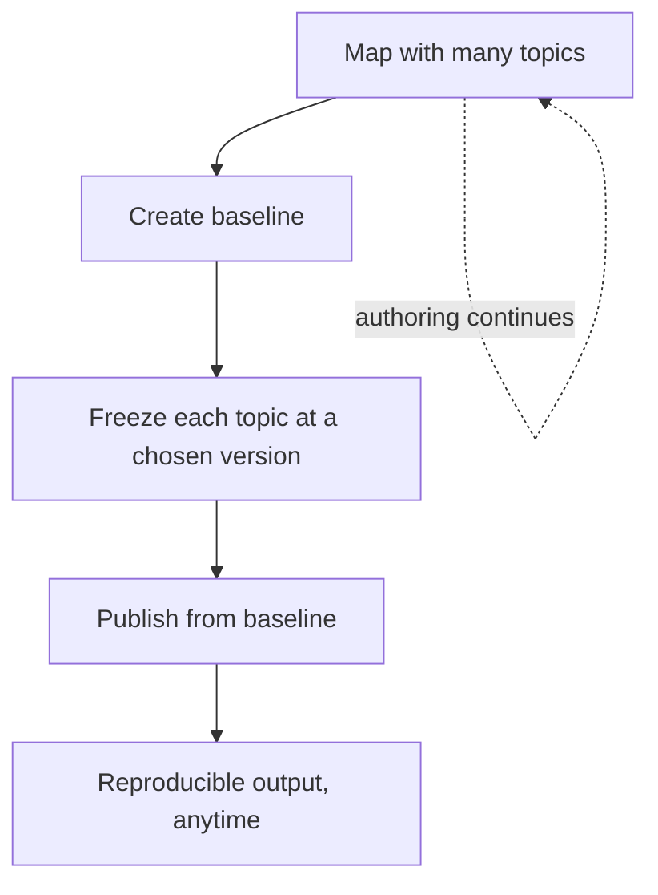

"Can you republish exactly what we shipped last quarter?" is a question that
terrifies teams without version control and is trivial with **baselines**. A
baseline captures specific versions of every topic in a map, so you can publish a
frozen snapshot even while the next release is being written. This guide shows how
to use them.

## The problem baselines solve

Authoring is continuous, but releases are discrete. Without baselines, publishing a
map always uses the latest versions, so an in-progress edit can leak into a
"finished" release. A baseline decouples the two.

## How a baseline works

A baseline is a record of "topic X at version 3, topic Y at version 7, ..." for
every topic in a map. Publishing from it always produces the same output,
regardless of later edits.

| Without baseline | With baseline |
| --- | --- |
| Publish uses latest versions | Publish uses frozen versions |
| In-progress edits leak in | Snapshot stays stable |
| Old release hard to reproduce | Republish exactly, anytime |

## Steps to create and use one

1. **Label** the approved versions of your topics (a clean way to select them).
2. Open the map and **create a baseline**, choosing latest or labeled versions.
3. Give it a clear, dated **name** ("v2.0 GA, 2025-06").
4. Attach the baseline to an **output preset** and publish.
5. Keep the baseline; republishing that release later is now one click.

The Create Baseline dialog listing topics with the version selected for each.

<strong>Best practice:</strong> Label first, then baseline from labels. It makes the snapshot intentional rather than "whatever was latest at the time."

## When to use baselines

- **Every formal release**, so it can be reproduced.
- **Regulated or audited content**, where "what we published" must be provable.
- **Parallel work**, when the next version is being written while the current one
  must stay stable.

## Troubleshooting

- **Baseline includes an unexpected draft.** It captured "latest" for a topic;
  recreate it from labeled versions.
- **A topic is missing from the baseline.** It wasn't referenced by the map when
  the baseline was created; add it to the map and recreate.
- **Republished output differs.** A different preset or template is in play;
  baselines fix content versions, not the template. Pin the template too.
- **Can't find an old release's baseline.** Establish a naming/retention convention
  so baselines are easy to locate.

## Takeaway

Baselines turn "what did we ship?" from a nightmare into a click. Label approved
versions, create a clearly named baseline per release, and publish from it. Your
releases become reproducible and auditable, no matter how much authoring happens
afterward.
