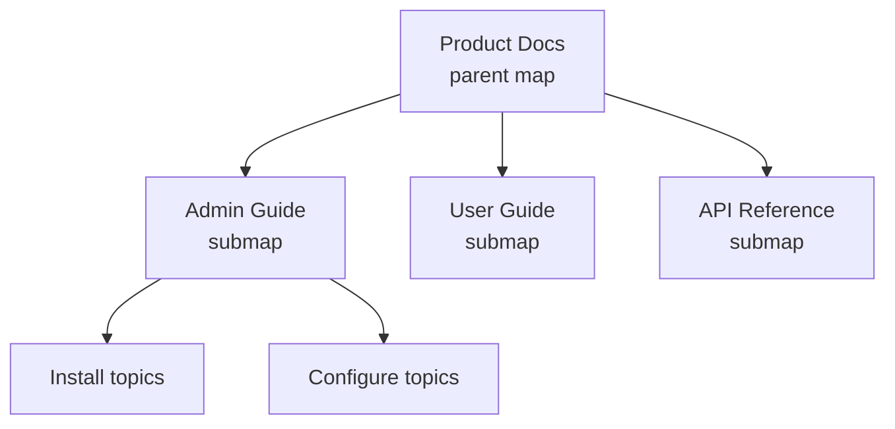

A good map structure is the difference between a documentation set that scales
gracefully and one that becomes a tangle nobody wants to touch. Because maps
define assembly, reuse, keys, and metadata, they deserve deliberate design. Here
is a pragmatic set of practices.

## Think in modules, like software

Treat maps the way you would treat code: small, composable, and reusable. A large
publication should be a **parent map** that references **submaps**, each owning a
coherent section.



## Separate reusable maps from deliverable maps

Keep two kinds of maps distinct:

- **Deliverable maps** define a specific output (the "Admin Guide PDF").
- **Reusable/library maps** group topics meant to be pulled into many
  deliverables (shared legal, shared setup).

Referencing a reusable submap into multiple deliverables means one edit updates
them all.

## Keep hierarchy shallow

Deep nesting (5+ levels) produces confusing tables of contents and brittle
structure. Aim for **2 to 4 levels**. If you need more, that is usually a sign to
split into a submap.

| Symptom | Likely fix |
| --- | --- |
| TOC is 6 levels deep | Break a branch into a submap |
| One map has 200+ topicrefs | Split by section into submaps |
| Same topics copied across maps | Extract a reusable submap |

## Put keys and metadata where they belong

- Define **keys (keydef)** in a high-level map (often a dedicated key-definitions
  map) so values are managed centrally.

  ```xml
  <map>
    <keydef keys="product-name"><topicmeta><keywords><keyword>Acme Cloud</keyword></keywords></topicmeta></keydef>
    <keydef keys="support-url" href="https://support.example.com" scope="external" format="html"/>
  </map>
  ```

- Apply **publication-wide metadata** on the parent map; apply section-specific
  metadata on submaps.

<div class="note"><strong>Pattern:</strong> A parent map that references a key-definitions map plus several section submaps is a structure that scales to thousands of topics without pain.</div>

## Naming conventions

Consistency here saves hours later:

- Name deliverable maps by output: `admin-guide.ditamap`.
- Name submaps by section: `admin-install.ditamap`.
- Name the key map clearly: `keydefs.ditamap`.
- Keep topic filenames descriptive and lowercase.

## Troubleshooting structural problems

- **"Reordering is painful."** Your map is too monolithic. Submaps make sections
  independently reorderable.
- **"Keys resolve differently per output."** That's intended: define keys per
  deliverable map to vary values. Verify each map's key definitions.
- **"Duplicate content across guides."** Extract the shared topics into a reusable
  submap and reference it.
- **"Broken links after a reorg."** Prefer keyref over direct href so links
  survive moves.

## Takeaway

Design maps like modular software: shallow hierarchy, submaps per section,
separate reusable libraries, and centralized keys and metadata. Add clear naming
and your documentation set will scale from one guide to an entire product line
without a rewrite.
