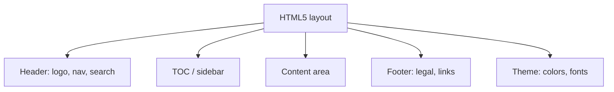

The default HTML5 output is clean, but readers should feel they're inside *your*
product, not a generic help portal. AEM Guides lets you customize the HTML5
**layout** so branding, navigation, and behavior match your experience. This guide
covers what you can change and how to approach it.

## The anatomy of an HTML5 layout

| Region | What you customize |
| --- | --- |
| Header | Logo, top navigation, search box placement |
| Sidebar / TOC | Structure, collapse behavior, width |
| Content | Typography, code styling, callouts |
| Footer | Copyright, links, contact |
| Theme | Colors, fonts, spacing, light/dark |

## Steps to customize

1. Start from a **layout/template** provided with AEM Guides.
2. Apply your **branding**: logo, color palette, and fonts.
3. Adjust **header, footer, and menu** structure to match your site.
4. Tune **search** placement and behavior.
5. Attach the layout to your **HTML5 output preset** and generate a test build.

A customized HTML5 site with brand logo, colors, and navigation matching the product site.

## Theming tips

- Define brand colors and fonts in one place so the whole output stays consistent.
- Respect **accessibility**: sufficient contrast, focus states, and readable font
  sizes.
- Consider a **light/dark** option if your product has one.

<strong>Tip:</strong> Keep customization in the layout/template, not in per-topic hacks. Topic-level styling doesn't survive regeneration and breaks single-sourcing.

## Integrating output into your site

You can host the generated HTML5 independently or **integrate it into AEM Sites**
so documentation shares your site's shell, navigation, and search. Integration
gives the most seamless experience but requires coordination with the web team.

## Search and findability

- Ensure the **search index** builds and is enabled in the preset.
- Good **titles and short descriptions** dramatically improve search results.
- Metadata can power **faceted filtering** in richer layouts.

## Troubleshooting

- **Branding not applied.** The preset points at the default layout; select your
  custom layout.
- **Menu structure wrong.** Navigation follows the map; fix hierarchy in the map,
  not the layout.
- **Search missing or empty.** Regenerate; confirm search is enabled and the index
  built.
- **Broken assets after deploy.** Path/base-URL mismatch on the host; check
  relative paths and deployment location.

## Takeaway

A custom HTML5 layout makes documentation feel native to your product. Brand it in
the layout template, keep customization out of individual topics, tune search and
accessibility, and consider integrating into AEM Sites for a seamless experience.
Attach it to a preset so every build is on-brand automatically.
