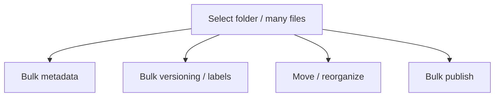

In a repository with thousands of topics, per-file clicking doesn't scale. AEM
Guides supports **bulk and folder-level operations** so you can apply changes to
many files at once. This guide covers what you can do in bulk and how to do it
without causing a mess.

## What you can do in bulk

| Operation | Saves you from |
| --- | --- |
| Apply metadata to a folder | Editing hundreds of files individually |
| Version/label many topics | Labeling a release one file at a time |
| Move/reorganize in bulk | Manual drag-and-drop of many items |
| Bulk publish | Running many jobs by hand |

## Steps for a safe bulk change

1. **Scope precisely.** Select the exact folder or set; over-broad selection is the
   main risk.
2. **Preview the impact.** Know how many items are affected and which.
3. **Apply** the operation.
4. **Spot-check** a sample of results.
5. **Rely on versioning** to revert if something looks wrong.

A folder selected in the Repository view with a bulk metadata action dialog open.

<strong>Rule:</strong> When you catch yourself repeating the same action across files, stop and look for the bulk or folder-level equivalent. It's usually there.

## Reorganizing without breaking links

Moving files in bulk is powerful but can break **direct references**. Two
protections:

- Prefer **keyref** for links so they survive moves.
- Run **link validation** after a big reorganization to catch anything that broke.

## Bulk operations and governance

- Apply **consistent metadata** to a whole content area at once.
- **Label** an entire deliverable for a release in one action.
- Enforce **folder profiles** so bulk-created content inherits the right defaults.

## Troubleshooting

- **Applied to more than intended.** Revert affected items via versioning; redo
  with a tighter scope.
- **Links broke after a move.** Run link validation; convert direct references to
  keyref where possible.
- **Bulk metadata didn't stick.** Some files may have been locked/checked out;
  retry after they're available.
- **Bulk publish overloaded the system.** Batch large publish runs, or publish from
  baselines during off-peak times.

## Takeaway

Bulk and folder-level operations turn repetitive drudgery into single, reviewable
actions. Scope tightly, preview impact, apply, and spot-check, with versioning as
your safety net. Combine bulk moves with keyref links and post-move validation, and
you can reorganize a large repository confidently.
