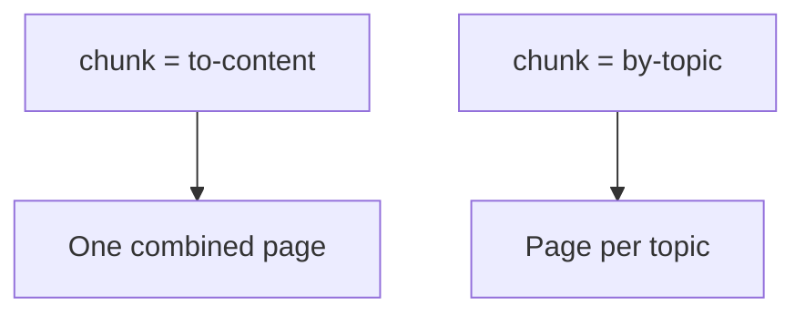

Two questions sit behind clean DITA output: how big should a topic be, and how
should topics combine into output pages? The answer to the first is a writing
discipline; the answer to the second is **chunking**. Get both right and your
content reuses cleanly and publishes to sensible pages.

## First, right-size your topics

The golden rule stays: **one idea per topic**. A topic too large won't reuse; a
topic too small can't stand alone.

| Symptom | Likely problem | Fix |
| --- | --- | --- |
| Topic covers 3 features | Too large | Split by feature |
| A topic is one sentence | Too small | Merge into its parent concept/task |
| Can't reuse a section | Buried inside a big topic | Extract it into its own topic |

## Then, control output with chunking

The `chunk` attribute tells the publisher how to combine topics into output
documents (especially for HTML, where it controls page boundaries).

```xml
<!-- Combine this branch into a single output page -->
<topicref href="install.dita" chunk="to-content">
  <topicref href="prereqs.dita"/>
  <topicref href="run-installer.dita"/>
</topicref>

<!-- Split each nested topic into its own page -->
<topicref href="reference.dita" chunk="by-topic">
  <topicref href="param-a.dita"/>
  <topicref href="param-b.dita"/>
</topicref>
```



- **to-content** merges a branch into a single page.
- **by-topic** produces a separate page per topic.

<div class="note"><strong>Why it matters:</strong> Chunking decides how your HTML5 output is paginated and how deep-linking and search behave. It's the bridge between authoring structure and reading experience.</div>

## Chunking and reuse together

Small, well-typed topics are the unit of reuse; chunking then assembles them into
the right output shape. Author for reuse first (many small topics), and use
chunking to present them as coherent pages, rather than writing giant topics just
to get one output page.

<div class="shot">The Map Editor showing a topicref with the chunk attribute set in the properties panel.</div>

## Best practices

- Author **small and typed**; assemble with chunking.
- Use **to-content** for short, closely related sequences you want on one page.
- Use **by-topic** for reference collections where each item deserves its own URL.
- Be consistent so readers get predictable page sizes.

## Troubleshooting

- **HTML pages are too long or too short.** Adjust `chunk` on the relevant
  topicrefs rather than merging or splitting the source topics.
- **Deep links break.** Combining topics with to-content changes anchor/URL
  structure; verify links after changing chunking.
- **PDF unaffected by chunking changes.** Chunking mainly influences topic-based
  output like HTML; PDF flows the whole map regardless.

## Takeaway

Size topics for reuse (one idea each), then use the `chunk` attribute to assemble
them into the right output pages. Keeping authoring granularity and output
pagination as separate decisions gives you both maximum reuse and a clean reading
experience.
