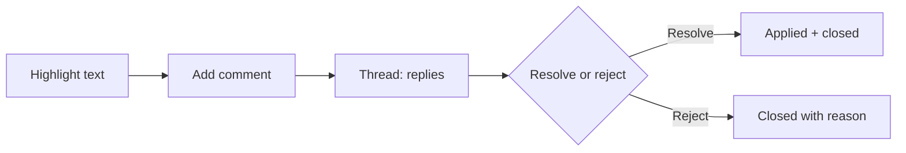

Once a review is running, the quality of the **comments** determines how fast and
how well content improves. AEM Guides supports threaded, in-context annotations
that keep discussion attached to the exact text. This guide is about using them
effectively, both as a reviewer and as an author.

## How annotations work

A reviewer highlights a span of text and attaches a comment. Others reply, forming
a **thread**, which the author then resolves or rejects with a reason.

## Comment status keeps things honest

| Status | Meaning |
| --- | --- |
| Open | Needs a decision |
| Resolved | Addressed and applied |
| Rejected | Considered, not applied (with reason) |

Tracking status means nothing is silently dropped, and everyone can see what's
left.

A comment thread on a highlighted phrase, with reply and resolve controls.

## Etiquette that speeds sign-off

For reviewers:

- Be **specific and actionable**: "Change 'click' to 'select' for consistency"
  beats "this reads oddly".
- Comment on **content**, not style the template controls.
- One issue per comment, so each can be resolved independently.

For authors:

- Reply to every thread, even a rejection, with a short reason.
- Resolve as you go so the open count trends to zero.
- Batch related edits, then mark the relevant threads resolved.

<strong>Mindset:</strong> Treat the comment list as a shared to-do list. A review is done when the open count is zero, not when the deadline passes.

## Annotations and the source

Reviewers comment; authors edit. Keeping that separation protects the DITA source
from well-meaning but structurally invalid changes, while still capturing every
suggestion.

## Troubleshooting

- **Can't resolve a comment.** You may lack the author/initiator role; the review
  owner resolves.
- **Comments disappeared.** They're likely filtered to "open"; switch the filter to
  see resolved/rejected.
- **Thread went off-topic.** Close it with a summary and open a new, specific
  comment.
- **Too many tiny comments.** Ask reviewers to focus on substantive issues; style
  belongs to the template.

## Takeaway

Threaded, in-context annotations with clear status turn review feedback into a
transparent, finishable to-do list. Comment specifically, keep author and reviewer
roles distinct, and drive the open-comment count to zero. That's how reviews close
quickly and cleanly.
