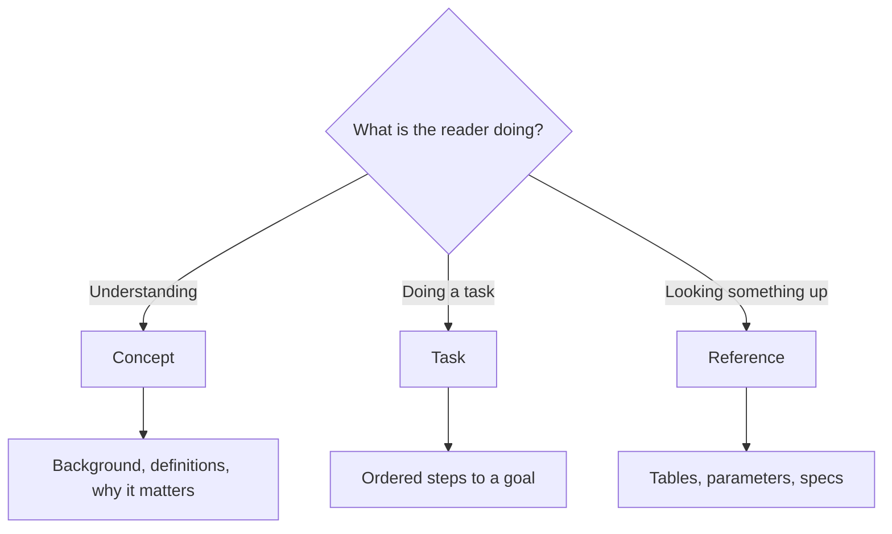

DITA's information typing is one of its quiet superpowers. By writing each piece
of content as a specific **type**, you get predictable structure, better reuse,
and cleaner output. AEM Guides supports the three core types plus glossary and
troubleshooting types. This guide focuses on getting the core three right.

## The decision in one picture



Ask one question: *what is the reader trying to do?* The answer picks the type.

## Concept topics

Concepts explain **what** something is or **why** it matters. They give
background and build understanding, but they do not give instructions.

```xml
<concept id="about-baselines">
  <title>About baselines</title>
  <conbody>
    <p>A baseline captures specific versions of every topic in a map...</p>
  </conbody>
</concept>
```

Use when: introducing a feature, explaining an architecture, defining terms.

## Task topics

Tasks are the workhorses of documentation. They give **ordered steps** to reach a
goal, and they have a strict, helpful structure.

```xml
<task id="create-baseline">
  <title>Create a baseline</title>
  <taskbody>
    <prereq>You have publish permission.</prereq>
    <steps>
      <step><cmd>Open the map.</cmd></step>
      <step><cmd>Choose Create Baseline.</cmd>
        <info>Give it a clear, dated name.</info>
      </step>
    </steps>
    <result>The baseline is saved and ready to publish from.</result>
  </taskbody>
</task>
```

Use when: any procedure. If it has steps, it is a task.

## Reference topics

References hold **lookup** information you scan rather than read: parameter
tables, specifications, API fields, error codes.

```xml
<reference id="output-formats">
  <title>Supported output formats</title>
  <refbody>
    <table>...</table>
  </refbody>
</reference>
```

Use when: the reader needs facts fast, not narrative.

## Comparison at a glance

| | Concept | Task | Reference |
| --- | --- | --- | --- |
| Answers | What / why | How | Which / what value |
| Structure | Prose | Ordered steps | Tables and lists |
| Reader mode | Learning | Doing | Looking up |
| Reuse potential | High | High | Very high |

<div class="note"><strong>Best practice:</strong> Keep types pure. If a concept starts sprouting numbered steps, split the steps into a separate task and link them.</div>

## Common mistakes and fixes

- **Everything is a "topic" (generic).** Generic topics lose the structural
  benefits. Prefer a specific type whenever you can.
- **A task with no steps.** If there are no steps, it is probably a concept.
- **A concept stuffed with procedures.** Split it; link the concept to the task.
- **Reference content written as prose.** Convert to a table so readers can scan.

## Troubleshooting

- **"Which type for release notes?"** Usually a concept or a reference (a table of
  changes), not a task.
- **"Where do warnings go?"** Inside the relevant step or paragraph, not as their
  own topic type.

## Takeaway

Match content to the reader's mode: concept for understanding, task for doing,
reference for looking up. Consistent typing makes your content easier to write,
reuse, translate, and read.
