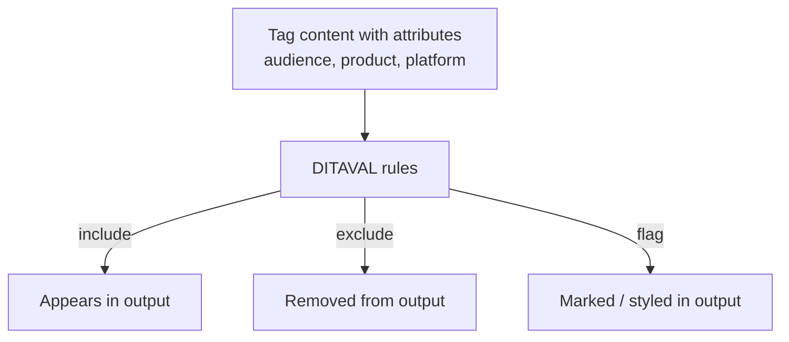

The promise of single-sourcing is "write once, publish many." **Conditional
content** is the engine that delivers it. You tag content with attributes, and a
**DITAVAL** file decides, at publish time, what to include, exclude, or flag. This
guide shows the full mechanism with a worked example.

## The two halves: tags and rules



Tagging lives in the content; the decision lives in the DITAVAL applied by the
output preset.

## Step 1: tag content

```xml
<p audience="admin">Run the migration as an administrator.</p>
<p audience="user">Ask your administrator to run the migration.</p>
<section product="pro">Advanced analytics is available in Pro.</section>
```

## Step 2: write a DITAVAL

```xml
<val>
  <prop att="audience" val="admin" action="include"/>
  <prop att="audience" val="user" action="exclude"/>
  <prop att="product" val="pro" action="flag" style="background-color:yellow"/>
</val>
```

This DITAVAL produces the **admin** edition: admin content in, user content out,
Pro content flagged for reviewers.

## Step 3: apply it in a preset

Attach the DITAVAL (or a named **condition preset**) to your output preset, then
generate. Swap the DITAVAL to produce the user edition from the same source.

<div class="shot">The condition/DITAVAL selection in an output preset, choosing the admin profile.</div>

## Include vs exclude vs flag

| Action | Result | Use for |
| --- | --- | --- |
| include | Content appears | The default audience/product |
| exclude | Content removed | Variants that must not see it |
| flag | Content kept but marked | Review, "new in Pro" badges |

<div class="note"><strong>Best practice:</strong> Tag at the smallest sensible level (a phrase or paragraph), and define your attribute values centrally so authors choose from a known list instead of inventing values.</div>

## Testing your profiles

Always generate and check **each** profile before release. A mistagged element can
silently leak admin-only content into a user PDF. A quick per-profile review is the
cheapest safeguard.

## Troubleshooting

- **Content leaked into the wrong output.** An element is untagged or mistagged;
  find it and correct the attribute.
- **DITAVAL had no effect.** The preset isn't using it, or attribute values don't
  match exactly (case-sensitive).
- **Too much excluded.** An exclude rule is broader than intended; narrow the
  attribute/value.
- **Flag not visible.** The output format may not render your flag style; verify
  the style and format support.

## Takeaway

Conditional publishing is two halves: tag content with attributes, then let a
DITAVAL include, exclude, or flag it per output. Tag finely, manage values
centrally, apply DITAVALs through presets, and test every profile. One source then
serves every audience and product without forks.
