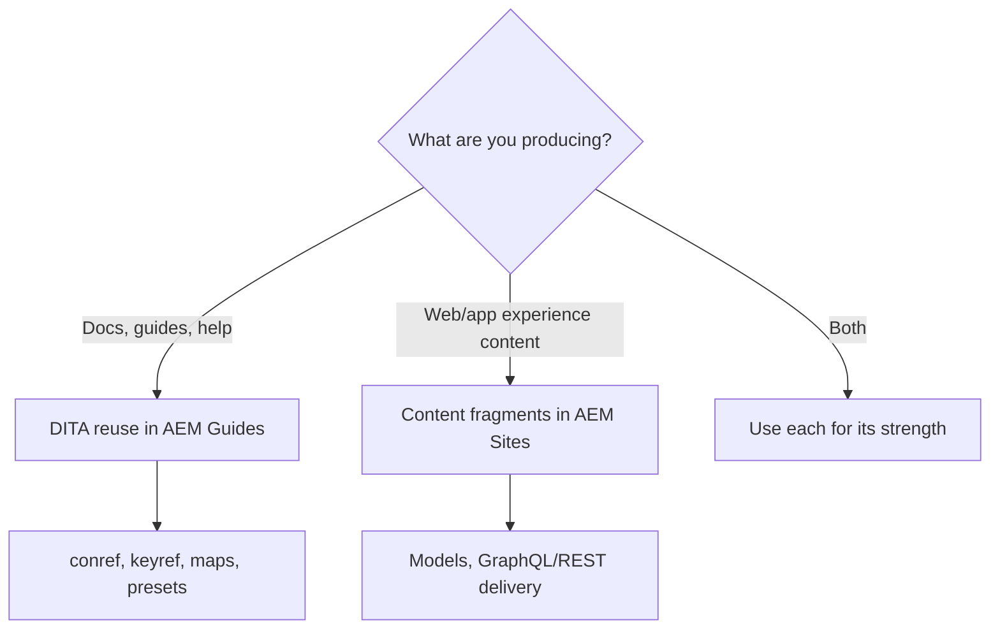

Two teams inside the same AEM ecosystem hear "reuse" and mean very different
things. **AEM Sites content fragments** and **AEM Guides DITA reuse** are both
legitimate, powerful, and easy to confuse. This guide draws the line so you pick
the right tool, or combine them deliberately.

## What each one is

- **Content fragments (AEM Sites)** are channel-agnostic content objects, edited in
  AEM and delivered through APIs (often headless) to websites, apps, and other
  front ends.
- **DITA reuse (AEM Guides)** is structured technical content reused through
  conref, keyref, and maps, and published to formats like PDF and HTML5.

## Side-by-side

| Dimension | Content fragments | DITA reuse |
| --- | --- | --- |
| Primary use | Marketing/experience content, headless delivery | Technical documentation at scale |
| Structure | Model-based fields | DITA topics, maps, elements |
| Reuse unit | Fragment / fragment element | Topic, element (conref), key (keyref) |
| Delivery | APIs / rendered pages | PDF, HTML5, and more via presets |
| Versioning/translation | AEM features | Built for modular docs; only changed topics re-translate |
| Audience | Web/app teams | Documentation teams |

## A decision guide

<strong>Short version:</strong> If the deliverable is documentation published to PDF/HTML5, reach for DITA reuse. If it's structured content served to web/app front ends via API, reach for content fragments.

## When they meet

They are not mutually exclusive. Common combinations:

- Publish **DITA output to AEM Sites** so documentation lives inside your web
  experience with shared branding and navigation.
- Surface small, shared snippets as content fragments for marketing while keeping
  the authoritative technical content in DITA.

## Anti-patterns to avoid

- **Rebuilding a CCMS with content fragments.** Fragments lack DITA's topic typing,
  conditional publishing, and print-grade output. Don't force documentation into
  them.
- **Using DITA to hand marketing raw web copy.** If the need is headless delivery
  of flexible content, fragments fit better.

## Troubleshooting the decision

- **"We need print/PDF."** That's DITA. Content fragments are not built for
  print-grade output.
- **"We need GraphQL delivery to a mobile app."** That's content fragments.
- **"We need audience/product conditional variants of a manual."** That's DITA
  conditional publishing.

## Takeaway

Content fragments and DITA reuse are complementary, not competing. Choose DITA
reuse for structured documentation and multi-format publishing; choose content
fragments for headless, experience-driven delivery. When it helps, let DITA output
flow into Sites so both worlds share one front door.
