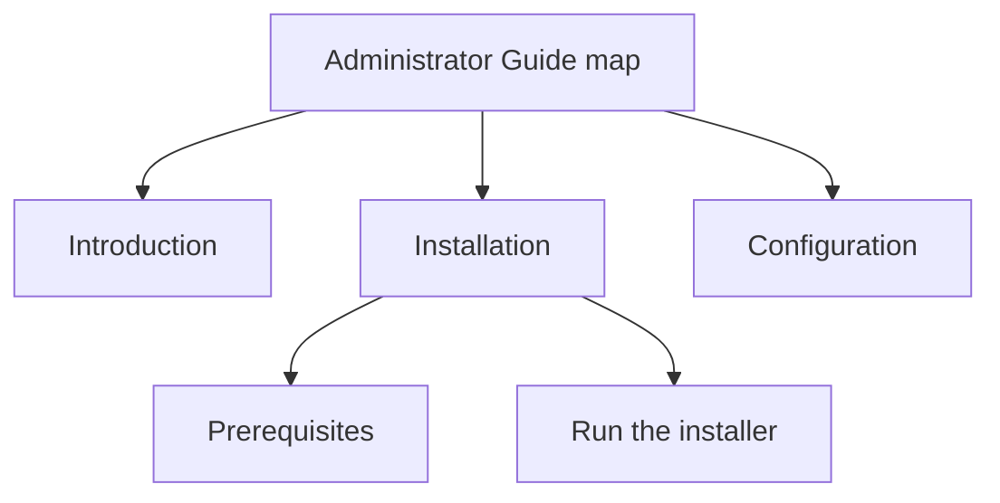

The **map** is the backbone of every deliverable in AEM Guides. It lists the
topics to include, sets their order, and defines the hierarchy that becomes your
table of contents. This walkthrough takes you from an empty folder to a
structured, previewable map.

## What a map actually is

A map is a small XML file of **topic references** (topicrefs). It holds no content
itself; it points to topics and arranges them.

```xml
<map>
  <title>Administrator Guide</title>
  <topicref href="intro.dita"/>
  <topicref href="install.dita">
    <topicref href="prereqs.dita"/>
    <topicref href="run-installer.dita"/>
  </topicref>
</map>
```

The nesting is your hierarchy: `prereqs` and `run-installer` become children of
`install`.

## The end goal



## Steps

1. **Pick a home folder.** In the Repository view, create or open a folder for
   this deliverable.
2. **Create the map.** Choose *Create → DITA Map* and pick a map template. Give it
   a clear title.
3. **Open it in the Map Editor.**

   <div class="shot">The Map Editor with an empty map open, ready to add topic references.</div>

4. **Add topics.** Drag existing topics in, or create new ones inline. Each becomes
   a topicref.
5. **Build hierarchy.** Indent topicrefs to nest them. Indentation is your TOC
   structure.
6. **Set the title topic** (optional) so the deliverable has a proper front page.
7. **Preview.** Use the preview/generate option to see the assembled output.

## Organize with submaps

For anything beyond a small guide, split the map into **submaps** and reference
them from a parent map:

```xml
<map>
  <title>Product Documentation</title>
  <mapref href="admin-guide.ditamap"/>
  <mapref href="user-guide.ditamap"/>
</map>
```

This keeps large projects modular and lets teams own sections independently.

<div class="note"><strong>Tip:</strong> Name maps by deliverable and submaps by section. A predictable naming scheme pays off as the project grows.</div>

## Metadata and keys in the map

Maps are also where you set deliverable-wide things:

- **Keys** (keydef) for reusable values and links.
- **Metadata** that applies to the whole publication.
- **Conditional presets** (DITAVAL) for filtered outputs.

## Troubleshooting

- **A topic won't appear in output.** Check that its topicref is inside the map
  and not accidentally set to `toc="no"` or excluded by a condition.
- **Wrong order in the TOC.** Order follows the map, top to bottom. Reorder the
  topicrefs.
- **Broken reference.** If a topic moved, the href is stale. Prefer keyref for
  links that may move.

## Takeaway

Start every project with a map. It is your outline, your table of contents, and
your publishing unit at once. Get the structure right early, lean on submaps for
scale, and the rest of authoring flows naturally.
