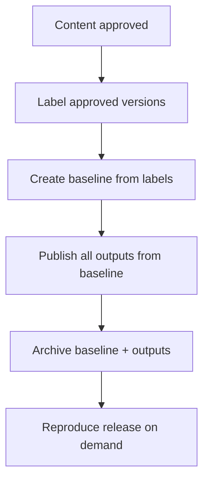

A "snapshot" is the disciplined act of freezing a point-in-time copy of content for
a specific release, so you can publish it now and reproduce it later. In AEM Guides
this is built from **labels** and **baselines**. This guide turns those features
into a repeatable release checklist.

## The release snapshot flow

## Step-by-step

1. **Approve** the content (reviews complete, status = approved).
2. **Label** the approved version of every topic and map in the deliverable, using
   a dated release name.
3. **Create a baseline** from those labels, so the exact versions are frozen.
4. **Publish every output** (PDF, HTML5, and any variants) from that baseline.
5. **Archive** the baseline name and generated outputs in a known location.
6. **Record** which preset/template versions were used, so the look is
   reproducible too.

A baseline named for the release, with its published PDF and HTML5 outputs archived.

<strong>Why archive the template too:</strong> A baseline freezes content versions, not the output template. To reproduce a release pixel-for-pixel, note the template/preset versions alongside the baseline.

## What a good snapshot gives you

| Benefit | Because |
| --- | --- |
| Reproducibility | Baseline fixes every topic version |
| Auditability | Labels document what shipped |
| Parallel work | Next version can be authored freely |
| Fast hotfixes | Branch from the snapshot, fix, republish |

## Snapshots and hotfixes

When a shipped release needs a correction, start from its baseline, make the
minimal change, label and baseline again (for example `v2.0.1`), and republish.
You fix exactly what shipped without dragging in unrelated in-progress work.

## Troubleshooting

- **Snapshot isn't reproducible.** You changed the template/preset since release;
  version those too and record which were used.
- **Baseline includes drafts.** It captured latest instead of labeled versions;
  recreate from labels.
- **Can't find last release's snapshot.** Adopt a naming and retention convention
  for baselines and archived outputs.

## Takeaway

A release snapshot is just labels plus a baseline plus archived outputs, done
consistently. Approve, label, baseline, publish, archive, and note the template
versions. That six-step ritual makes every release reproducible, auditable, and
safe to build on.
