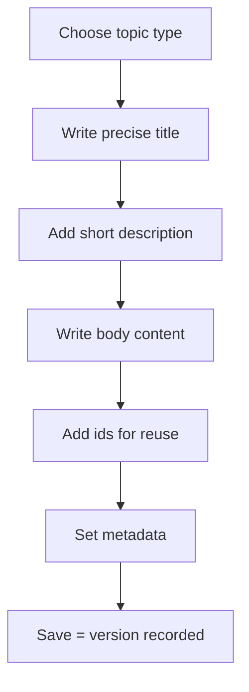

Topics are where your real content lives. In AEM Guides you create them right in
the browser, and the Web Editor keeps the underlying DITA valid while you write.
This guide walks through creating a solid first topic and the habits that make it
reusable from day one.

## Before you start: one idea per topic

The single most useful rule in structured authoring: a topic should cover **one
idea** and stand on its own. A reader who lands on it out of context should still
understand it. That discipline is what makes topics reusable and translatable.



## Steps

1. **Create the topic.** In your folder, choose *Create → DITA Topic* and select a
   type (concept, task, or reference).
2. **Write a precise title.** Titles are navigation and search. "Configure SSO" is
   better than "Configuration".
3. **Add a short description.** The `<shortdesc>` becomes previews, search
   snippets, and link summaries.

   ```xml
   <concept id="configure-sso">
     <title>Configure single sign-on</title>
     <shortdesc>Connect your identity provider so users sign in once.</shortdesc>
     <conbody>
       <p>...</p>
     </conbody>
   </concept>
   ```

4. **Write the body** using the toolbar to insert paragraphs, lists, notes, and
   tables. Stay in the visual view; switch to XML only when you want to.

   <div class="shot">The Web Editor showing a topic with title, short description, and body content.</div>

5. **Save.** A version is recorded, so you can always look back.

## Author for reuse from the start

Give reusable elements an **id** so other topics can pull them in later with
conref:

```xml
<note id="admin-rights-note">Administrator rights are required for this step.</note>
```

Now any topic can reference `admin-rights-note` instead of repeating the warning.

<div class="note"><strong>Habit:</strong> Add ids to elements you suspect you'll reuse (warnings, product names, shared steps). It costs nothing now and saves editing later.</div>

## Add metadata

Set audience, product, or status metadata so the topic is filterable and
governable later. Consistent metadata is what powers search, reports, and
conditional publishing.

## Validate as you go

The editor validates against the DITA content model. If an element is out of
place, you'll see it immediately. This is a feature: it guarantees your content
publishes and translates cleanly.

## Troubleshooting

- **"Invalid element here."** DITA has strict rules about what goes where. Move the
  element inside a valid parent (for example, a `<p>` inside `<conbody>`).
- **"My short description isn't showing in previews."** Confirm it's a real
  `<shortdesc>`, not a first paragraph.
- **"The title has odd characters after publish."** Check for stray formatting
  pasted from Word; paste as plain text.

## Takeaway

Pick a type, write a precise title and short description, keep to one idea, add
ids for reuse, and let validation guide you. Do that and your very first topic is
already clean, reusable, and ready to publish.
