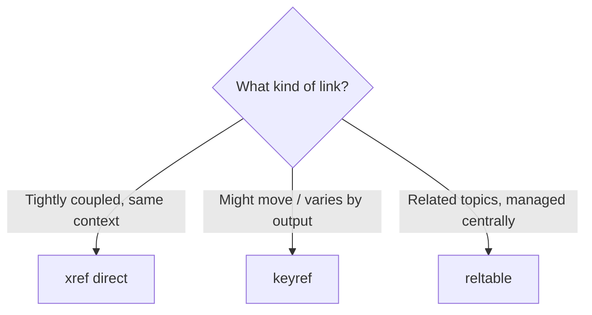

Links are where documentation quietly breaks. A reorganized folder, a renamed
file, or a reused topic can turn a helpful cross-reference into a dead end. DITA
gives you several linking mechanisms, and choosing the right one for each job is
what keeps links durable. This guide lays out the options and the rules.

## The three ways to link



| Mechanism | Best for | Durability |
| --- | --- | --- |
| `xref` (direct href) | Links inside tightly coupled content | Breaks if target moves |
| `keyref` | Links that may move or vary per deliverable | Survives moves |
| Reltable | Related-topic links across a deliverable | Managed centrally |

## Internal links

Prefer keyref for internal links so a reorganization doesn't shatter them:

```xml
<!-- keydef in a map -->
<keydef keys="configure-sso" href="topics/configure-sso.dita"/>

<!-- in a topic -->
<xref keyref="configure-sso">Configure single sign-on</xref>
```

Direct xref is fine for a link between two topics that always travel together:

```xml
<xref href="sso-parameters.dita">SSO parameters</xref>
```

## External links

External links need `scope` and `format` so the publisher treats them correctly:

```xml
<keydef keys="support-url" href="https://support.example.com"
        scope="external" format="html"/>

<xref keyref="support-url">support portal</xref>
```

<div class="note"><strong>Rule of thumb:</strong> If a link target could ever move, or the same topic ships in multiple products, use keyref. Reserve direct xref for content that is genuinely inseparable.</div>

## Link text and accessibility

- Use meaningful link text ("Configure SSO"), never "click here".
- For keyref links, you can let the target's title supply the text, keeping link
  labels consistent automatically.

<div class="shot">The Web Editor "Insert Cross-Reference" dialog with the keyref option selected.</div>

## Best practices summary

- Default to **keyref** for internal and external links.
- Use **reltables** for related-topic sections instead of hand-coding them.
- Keep external URLs in the **key map**, not scattered in topics.
- Run **link validation** before every release.

## Troubleshooting

- **Broken link after reorg.** A direct href pointed at a moved file. Convert to
  keyref.
- **External link renders as plain text.** Missing `scope="external"` and
  `format="html"` on the keydef.
- **Link text is empty.** For keyref, ensure the target has a title or provide
  explicit link text.
- **Duplicate related links.** Hard-coded links plus a reltable; remove the
  hard-coded ones.

## Takeaway

Choose the linking mechanism by durability: keyref for anything that might move,
reltables for related-topic sets, and direct xref only for inseparable content.
Centralize external URLs, write meaningful link text, and validate links each
release. Do that and broken links stop being a recurring chore.
