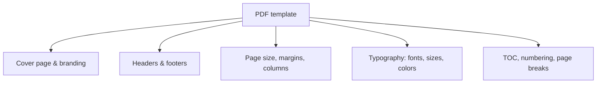

A PDF that looks generic undermines otherwise excellent content. **PDF templates**
in AEM Guides let you control the entire look of a published document, from the
cover to the page footer. This guide explains what a template governs and how to
approach customization for both PDF engines.

## What a PDF template controls

| Area | Examples |
| --- | --- |
| Cover | Logo, title, edition, date, background |
| Running heads | Chapter title, page numbers, confidentiality notice |
| Layout | Page size, margins, single vs multi-column |
| Typography | Font families, heading styles, colors |
| Structure | Table of contents, chapter breaks, numbering |

## Native PDF vs DITA-OT templates

- **Native PDF** uses a modern, CSS-like template model. Designers can iterate on
  layout and styling quickly, which is why it's the preferred route for
  design-heavy PDFs.
- **DITA-OT PDF** is customized through the PDF plugin (page layouts and XSL/FO
  style customizations), familiar to long-time DITA teams.

<strong>Recommendation:</strong> For new, brand-heavy PDF work, start with native PDF. Its template model is far friendlier for visual iteration than XSL/FO customization.

## Steps to apply and tune a template

1. Choose or create a **PDF template** for your brand.
2. Set the **cover** (logo, title fields driven by metadata/keys).
3. Configure **headers/footers** (chapter, page numbers, legal text).
4. Define **page layout** (size, margins, columns).
5. Set **typography** to match brand fonts and heading styles.
6. Attach the template to your **PDF output preset** and generate a test document.

A native PDF template editor showing cover, header/footer, and typography settings.

## Drive dynamic values with keys and metadata

Put the product name, version, and edition behind **keys** so the same template
produces correct covers and running heads for every product, without editing the
template.

## Troubleshooting

- **Fonts render as fallback.** The brand fonts aren't embedded/available; add
  them to the template configuration.
- **Logo misplaced or stretched.** Check the cover's image dimensions and
  placement settings.
- **Headers show the wrong title.** The running head is pulling the wrong field;
  verify the metadata/key it references.
- **Unexpected page breaks.** Chapter-break and keep-with settings in the template
  need adjustment.
- **Template change not visible.** The preset points at an older template version;
  update the preset.

## Takeaway

A strong PDF template is a one-time investment that makes every future publish look
on-brand automatically. Prefer native PDF for its modern template model, drive
dynamic cover and header values with keys and metadata, and attach the template to
a reusable preset so consistency is the default.
