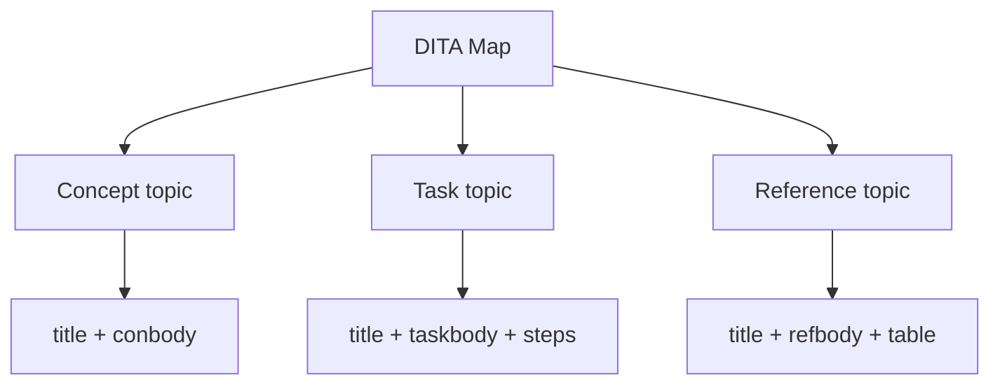

DITA (Darwin Information Typing Architecture) is the XML standard underneath AEM
Guides. You do not need to become an XML programmer, but understanding a handful
of ideas will make everything in the tool click. This is the practical
foundation.

## The big idea: separate content from format

In DITA, you write **meaning**, not appearance. You mark a paragraph as a
paragraph, a step as a step, a warning as a warning. How it looks (font, spacing,
page layout) is decided later, at publish time, by templates. That separation is
what makes one source publish cleanly to PDF, HTML5, and beyond.

## The building blocks



### Topics

A **topic** is a small, standalone chunk of content about one subject. Good topics
answer a single question and can be understood on their own.

### Maps

A **map** is an ordered list of topic references. It is your table of contents and
your publishing unit. Topics hold content; maps decide sequence and hierarchy.

### Topic types

DITA gives you specialized topic types so structure stays consistent:

| Type | Purpose | Signature element |
| --- | --- | --- |
| Concept | Explain what/why | `<conbody>` |
| Task | Step-by-step how-to | `<taskbody>` with `<steps>` |
| Reference | Lookup data | `<refbody>` with tables |

## Real DITA: a task topic

```xml
<task id="restart-service">
  <title>Restart the service</title>
  <taskbody>
    <steps>
      <step><cmd>Open the admin console.</cmd></step>
      <step><cmd>Select the service and click Restart.</cmd></step>
    </steps>
  </taskbody>
</task>
```

Notice there is no formatting anywhere, only structure. That is the point.

## Reuse is built in

Instead of copy-paste, DITA references content:

- **conref** pulls an element from one topic into another.
- **keyref** points to a key defined in a map, so the same topic behaves
  differently in different deliverables.

Change the source once and every reference updates.

## Conditional content

Attributes like `audience`, `product`, and `platform` let you tag content and then
include or exclude it at publish time:

```xml
<p audience="admin">This step requires administrator rights.</p>
```

A DITAVAL file decides whether that paragraph appears in a given output.

<div class="note"><strong>Mindset shift:</strong> Stop thinking in documents and start thinking in small, typed, reusable topics assembled by maps. Everything else in AEM Guides follows from that.</div>

## Troubleshooting the learning curve

- **"My topic won't validate."** An element is in the wrong place. The editor's
  validation tells you where; DITA has strict content models on purpose.
- **"Where did my formatting go?"** There isn't any in the source. Styling comes
  from the output template.
- **"Why split into so many topics?"** Small topics reuse and translate far
  better. Aim for one idea per topic.

## Takeaway

Topics, maps, topic types, references, and conditions are the whole foundation.
Master those five and you can read, write, and reason about any DITA content in
AEM Guides.
