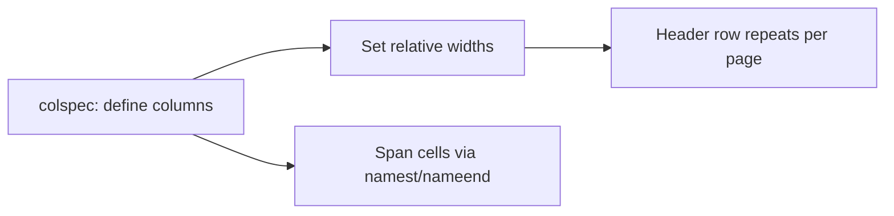

Tables are everywhere in technical content, and DITA tables can look intimidating
in raw XML. The good news: the AEM Guides Web Editor lets you build and edit them
visually while keeping the markup valid. This guide covers the table types, the
common operations, and the details that make tables accessible and publish-ready.

## Two table models in DITA

| Model | Best for | Notes |
| --- | --- | --- |
| CALS `<table>` | Most tables | Rich control: spans, column widths, header rows |
| `<simpletable>` | Simple grids | Lightweight, fewer options, great for reference data |

Use CALS when you need spanning or precise columns; use simpletable when you just
need rows and columns of comparable data.

## What a CALS table looks like

```xml
<table>
  <tgroup cols="2">
    <thead>
      <row><entry>Setting</entry><entry>Description</entry></row>
    </thead>
    <tbody>
      <row><entry>Timeout</entry><entry>Seconds before the session ends.</entry></row>
    </tbody>
  </tgroup>
</table>
```

You will rarely type this. The editor generates it as you work.

## Steps to build a table

1. Place your cursor in a valid spot and choose **Insert Table**.
2. Set the initial number of **rows and columns**.
3. Mark the top row as a **header** so it repeats and styles correctly.
4. Type your content cell by cell (Tab moves across).
5. Add or remove rows and columns from the table toolbar as needed.
6. **Merge cells** to create spanning headers where the data calls for it.

<div class="shot">The Web Editor table toolbar with options to add rows, columns, and merge cells.</div>

## Column widths and spanning



- **Column widths** are controlled by `colspec` entries (often relative, like
  `1*` and `2*`).
- **Spanning** uses `namest`/`nameend` for columns and `morerows` for rows. The
  editor's merge action writes these for you.

## Accessibility and quality

- Always mark a **header row** so assistive technology and output styling know it.
- Keep tables for **tabular data**, not layout. Use lists or sections for layout.
- Add a concise `<title>` to the table when it needs a caption.

<div class="note"><strong>Tip:</strong> A table used purely to position content will fight you in every output format. If it isn't data, it probably shouldn't be a table.</div>

## Troubleshooting

- **"Columns don't line up in PDF."** Check your `colspec` widths; inconsistent or
  missing specs cause uneven columns.
- **"The header repeats oddly across pages."** Confirm the header is in `<thead>`,
  not the first `<tbody>` row.
- **"Merge won't apply."** You can only merge adjacent cells; select a valid
  rectangular range first.
- **"Pasted table is a mess."** Paste from Excel/Word can bring junk. Paste as
  plain text and rebuild, or clean it in Source view.

## Takeaway

Choose CALS for rich tables and simpletable for simple grids, build them visually,
always mark a header row, and reserve tables for real data. The editor keeps the
DITA valid so your tables publish and stay accessible everywhere.
