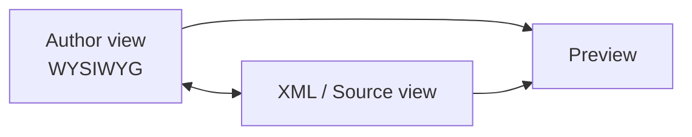

The **Web Editor** is where most authoring happens in AEM Guides, entirely in the
browser with no desktop tool required. Learning its layout and a few habits turns
it from unfamiliar to fast. This is the working tour.

## The views you'll switch between



- **Author view** is a clean, WYSIWYG-style writing surface.
- **Source (XML) view** shows the underlying DITA when you want precision.
- **Preview** renders the topic closer to output.

Most of the time you live in Author view and dip into Source only when needed.

<div class="shot">The Web Editor interface: toolbar, content area, and the element/structure panel.</div>

## Inserting structure

Use the toolbar or quick-insert to add elements without memorizing DITA:

- Paragraphs, ordered and unordered lists.
- Notes, warnings, and tips.
- Tables (with header rows and spanning).
- Images and media references.
- Cross-references and reused content.

## Working with references, not copies

Two toolbar actions save you the most time long term:

- **Insert content reference (conref)** to pull in a shared element.
- **Insert cross-reference / keyref** to link without hard-coding paths.

```xml
<p conref="warnings.dita#warnings/data-loss"/>
```

## Inline validation

As you edit, the editor checks your content against the DITA model and highlights
problems in place. Treat these prompts as guardrails: fixing them as you go keeps
publishing and translation trouble-free.

## Autosave, versions, and locking

- **Autosave** protects work in progress.
- **Versions** are recorded so you can compare and revert.
- **Locking / check-out** prevents two authors clobbering each other.

<div class="note"><strong>Tip:</strong> Save intentionally at meaningful milestones and label important versions. It makes your history navigable, not just a wall of autosaves.</div>

## Shortcuts worth learning

| Action | Why it helps |
| --- | --- |
| Insert element | Fastest way to add structure |
| Bold / italic / inline code | Common inline formatting |
| Insert table | Skips a lot of clicking |
| Toggle source view | Jump to XML for a quick fix |
| Save | Commit a version deliberately |

Pick three you use hourly and commit them to muscle memory.

## Troubleshooting

- **"I can't type where I want."** The cursor is outside a valid text location.
  Click inside a paragraph or add one.
- **"The toolbar option is greyed out."** That element isn't valid at the current
  position; move to a valid parent.
- **"My change vanished."** Check whether you were editing a conref source vs. the
  reference, and confirm you saved.

## Takeaway

Learn the three views, insert structure from the toolbar, prefer references over
copies, and heed inline validation. A handful of shortcuts later, the Web Editor
is as quick as any desktop authoring tool, with governance built in.
