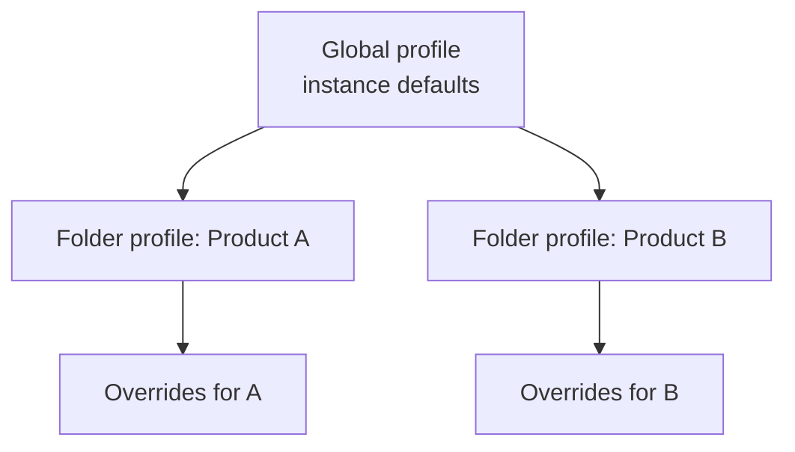

Consistency at scale doesn't come from asking authors to remember rules; it comes
from **profiles** that encode those rules once. AEM Guides uses global and folder
profiles to define editor behavior, metadata, conditions, and more. This guide
explains the model and how to use it as your team grows.

## Global vs folder profiles

- **Global profile** sets defaults for the whole instance.
- **Folder profiles** override those defaults for a specific content area, so
  different products or teams can differ where they need to.

Folder settings take precedence over global for that area, giving you shared
defaults with local flexibility.

## What profiles control

| Setting group | Examples |
| --- | --- |
| Editor | Which elements/templates authors see, editor behavior |
| Metadata | Available fields and controlled values |
| Conditions | Allowed profiling attributes and values |
| Output | Default presets and templates for the area |
| Language | Source and target languages for translation |

A folder profile configuration screen showing editor, metadata, and output defaults.

## A scaling pattern

1. Set sensible **global defaults** every author should get.
2. Create a **folder profile per product or major area**.
3. Override in the folder profile **only** what genuinely differs.
4. Onboard new areas by cloning a known-good folder profile.

<strong>Principle:</strong> Global for what everyone shares, folder for what a team needs differently. Resist per-file configuration; it's where consistency goes to die.

## Why this matters

- **Consistency:** every author in an area gets the same elements, metadata, and
  conditions.
- **Fewer mistakes:** controlled options prevent invalid or off-standard choices.
- **Faster onboarding:** new authors inherit correct settings automatically.
- **Easier changes:** update a profile once, and the whole area follows.

## Troubleshooting

- **Authors see different options.** They're under different folder profiles; align
  the profiles or move content.
- **A setting won't take effect.** A folder profile overrides your global change
  for that area; update the folder profile.
- **New content lacks the right defaults.** It's outside any tuned folder profile;
  place it under one or extend coverage.
- **Too many near-identical profiles.** Consolidate; keep overrides minimal.

## Takeaway

Profiles encode your standards so authors don't have to. Set shared defaults
globally, override per folder only where needed, and onboard by cloning good
profiles. That structure keeps a growing team and content set consistent without
constant policing.
