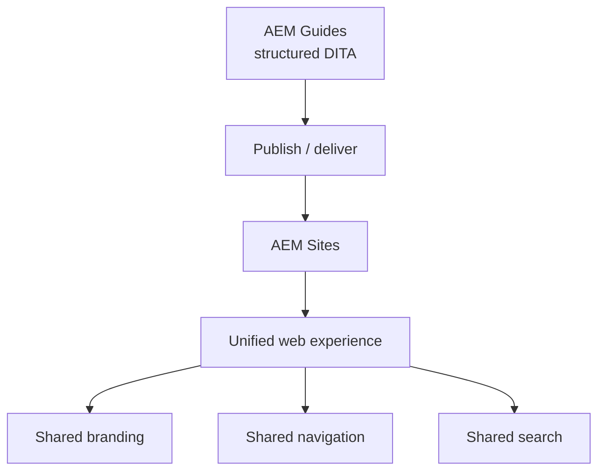

Documentation is part of the customer experience, so it makes sense for it to live
inside your web experience rather than a separate silo. Because AEM Guides is built
on AEM, it can **integrate with AEM Sites** to deliver structured content through
your website. This guide explains why and how.

## Why integrate

| Benefit | Because |
| --- | --- |
| Unified brand | Docs use the same site shell and styling |
| One navigation | Users move between product and docs seamlessly |
| Shared search | Documentation is findable from the site |
| Single platform | One AEM stack for marketing and docs |

## Integration approaches

- **Publish DITA output into Sites** so generated documentation is served through
  the AEM website with consistent chrome.
- **Surface content via delivery** so documentation content can appear within Sites
  pages and experiences.

The right approach depends on how tightly you want docs woven into the site versus
served as a distinct, well-branded section.

A product website with an in-site documentation section sharing the same header and search.

## What to align

1. **Branding:** ensure the HTML5 layout or delivered content matches the site
   theme.
2. **Navigation:** decide how users move between site and docs.
3. **Search:** unify or clearly connect site search and docs search.
4. **URLs:** plan a clean, stable URL structure for documentation.

<strong>Coordinate early:</strong> Integration touches both the docs team and the web team. Agree on branding, navigation, and URLs up front to avoid rework.

## Practical considerations

- **Ownership:** clarify who owns the docs section within the site.
- **Publishing cadence:** align doc releases with site deployment processes.
- **Performance:** large documentation sets need sensible loading and search
  behavior.
- **Access:** decide whether any docs are gated vs public.

## Troubleshooting

- **Docs look off-brand in the site.** The layout/theme isn't aligned; match the
  HTML5 layout to the site.
- **Broken links after integration.** Base URLs/paths differ once served through
  Sites; verify and prefer keyref-based links.
- **Search feels disjointed.** Users expect one search; connect or unify the two
  indexes.
- **Publishing and deployment clash.** Align the docs release cadence with the
  site's deployment pipeline.

## Takeaway

Integrating AEM Guides with AEM Sites lets technical content live natively inside
your digital experience, sharing branding, navigation, and search. Choose an
integration approach that matches how tightly you want docs woven in, align
branding and URLs early with the web team, and your documentation becomes a
seamless part of the product experience.
