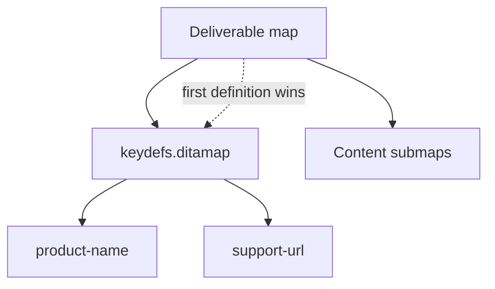

Keys are only as good as the definitions behind them. A **key definition
(keydef)** binds a key name to a value: a piece of text, a link target, or a
media file. Getting your keydefs organized is what makes keyref reliable across a
large documentation set. This guide covers the syntax, scope rules, and a clean
pattern to manage them.

## Anatomy of a keydef

```xml
<!-- Text value -->
<keydef keys="product-name">
  <topicmeta><keywords><keyword>Acme Cloud</keyword></keywords></topicmeta>
</keydef>

<!-- External link -->
<keydef keys="support-url" href="https://support.example.com"
        scope="external" format="html"/>

<!-- Internal topic target -->
<keydef keys="install-topic" href="topics/install.dita"/>

<!-- Reusable image -->
<keydef keys="logo" href="images/logo.png" format="png"/>
```

One keydef, referenced anywhere by `keyref`, `conkeyref`, or `href="...keyref"`.

## Where definitions live and how they win



- Keys are resolved within the **root map** being published.
- If the same key is defined more than once, **the first definition encountered
  wins** (map order and key scopes matter).
- **Key scopes** let you namespace keys so the same key name can mean different
  things in different branches of a large map.

## The central key-map pattern

Keep keydefs out of content and in a dedicated map:

```xml
<map>
  <title>Product Guide</title>
  <mapref href="keydefs.ditamap"/>   <!-- all keys here -->
  <mapref href="admin.ditamap"/>
  <mapref href="user.ditamap"/>
</map>
```

Then maintain edition-specific key maps (`keydefs-pro.ditamap`,
`keydefs-lite.ditamap`) and swap them per deliverable.

<div class="note"><strong>Governance tip:</strong> One team should own the key map. Uncontrolled keydefs scattered across content maps are the main cause of "why is this key showing the wrong value?"</div>

<div class="shot">The keydefs map in the Map Editor, showing text, link, and media key definitions.</div>

## Naming keys well

- Use clear, stable names: `product-name`, `support-url`, `min-version`.
- Group by prefix for large sets: `ui-`, `url-`, `img-`.
- Avoid encoding the value in the name (`product-name`, not `acme-cloud`), so the
  value can change without renaming the key.

## Troubleshooting

- **Wrong value resolves.** A duplicate keydef earlier in the map wins. Search for
  the key across your maps and consolidate.
- **Key works in one guide, not another.** The second deliverable map doesn't
  reference the key map, or references a different one.
- **Key scope confusion.** If you use `keyscope`, remember keys are namespaced;
  reference them with the scope prefix where required.
- **Media key not rendering.** Check the `format` attribute matches the file type.

## Takeaway

Define keys deliberately in a dedicated, owned key map, understand that the first
definition wins, and use edition-specific key maps to vary a build. Well-managed
keydefs are the foundation that makes all keyref-based reuse dependable.
