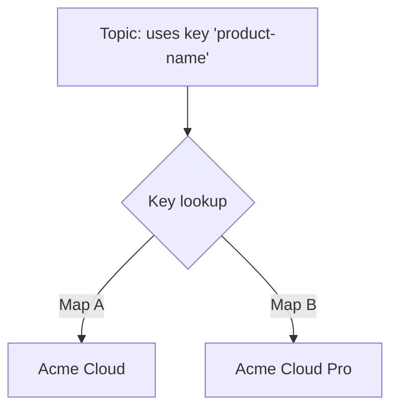

If conref reuses *content*, **keyref** reuses through *indirection*. Instead of
pointing at a fixed file or element, you point at a **key**, and a map decides what
that key means. That one layer of indirection is what makes DITA content portable
across products, releases, and outputs.

## The core idea



The topic never changes. The **map** binds the key to a value, so the same topic
reads "Acme Cloud" in one deliverable and "Acme Cloud Pro" in another.

## Defining and using a key

Define the key in a map with `keydef`:

```xml
<map>
  <keydef keys="product-name">
    <topicmeta><keywords><keyword>Acme Cloud</keyword></keywords></topicmeta>
  </keydef>
  <keydef keys="support-portal" href="https://support.example.com"
          scope="external" format="html"/>
</map>
```

Reference it in a topic:

```xml
<p>Welcome to <keyword keyref="product-name"/>.</p>
<p>Visit the <xref keyref="support-portal">support portal</xref>.</p>
```

## Why keyref beats hard-coded values and paths

| Problem with direct references | How keyref solves it |
| --- | --- |
| Product renamed everywhere | Change one keydef |
| Same topic, different product | Redefine keys per map |
| File moved, links broke | Keys resolve through the map, not paths |
| External URL changed | Update one keydef |

<div class="note"><strong>Rule of thumb:</strong> Any value or link that might change, or that differs across deliverables, belongs behind a key.</div>

## Keys for links, variables, and reused topics

- **Variables:** product names, version numbers, UI labels.
- **Links:** internal cross-references and external URLs.
- **Reused topics:** `conkeyref` combines keyref indirection with conref reuse.

## A per-deliverable pattern

Keep a **key-definitions map** per deliverable and reference it from the
deliverable map:

```xml
<map>
  <title>Acme Cloud Pro Guide</title>
  <mapref href="keys-pro.ditamap"/>
  <mapref href="shared-content.ditamap"/>
</map>
```

Swap `keys-pro.ditamap` for `keys-standard.ditamap` and the same content publishes
for a different edition.

<div class="shot">A key-definitions map open in the Map Editor, listing keydefs for product name and URLs.</div>

## Troubleshooting

- **Key not resolving (shows blank or the key name).** The key isn't defined in a
  map in scope, or the deliverable map doesn't reference the key map.
- **Wrong value appears.** Two maps define the same key; the effective one wins by
  map precedence. Check which key map is referenced.
- **Link goes nowhere.** For external links, confirm `scope="external"` and
  `format="html"` on the keydef.

## Takeaway

keyref adds a single, powerful layer of indirection: topics reference keys, maps
define them. Put every changeable value and link behind a key, keep per-deliverable
key maps, and your content becomes reusable across products and releases without a
single hard-coded path.
