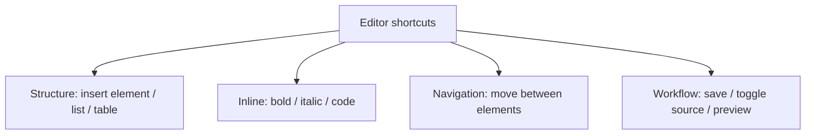

Authoring speed is not about typing faster; it's about removing friction between
your intent and the content. In the AEM Guides Web Editor, a handful of **keyboard
shortcuts** eliminate constant trips to the toolbar. This guide covers the
categories worth learning and how to make them stick.

## Categories of shortcuts

| Category | Why it helps |
| --- | --- |
| Insert structure | Add paragraphs, lists, tables without the mouse |
| Inline formatting | Bold, italic, inline code in a keystroke |
| Element navigation | Jump between elements and levels quickly |
| Workflow | Save deliberately, toggle source, preview |

<strong>Exact keys vary by version and OS.</strong> Check the editor's shortcut reference in your instance, then learn the few you'll use most.

## Build the habit

1. Pick **three** shortcuts you'd use every hour (likely: insert element, save,
   toggle source).
2. Force yourself to use them for a week, even when slower at first.
3. Add a couple more once those are automatic.
4. Keep a sticky note until muscle memory takes over.

The Web Editor's keyboard shortcut reference panel listing available shortcuts.

## Pair shortcuts with reuse

Shortcuts speed up typing; **reuse** removes typing entirely. The fastest authors
combine both:

- Insert a **conref** instead of retyping a shared warning.
- Insert a **keyref** for product names and links.
- Use **snippets** for common structures you build often.

The keystroke saves seconds; the reference saves the edit forever.

## A productivity mindset

| Instead of | Do this |
| --- | --- |
| Reaching for the mouse to format | Inline formatting shortcut |
| Retyping a shared note | Insert conref |
| Typing the product name again | keyref |
| Clicking through menus to save | Save shortcut |

## Troubleshooting

- **A shortcut does nothing.** It may be browser-reserved or differ on your OS;
  check the editor's shortcut reference.
- **Shortcut inserts in the wrong place.** The cursor is at an invalid location;
  move into a valid element first.
- **Can't remember them.** Learn three at a time, not twenty; add more only once
  they're automatic.

## Takeaway

Speed comes from removing friction: learn a few high-frequency editor shortcuts,
build the habit three at a time, and pair keystrokes with reuse so you type shared
content once. Small savings, repeated hundreds of times a day, add up to real
productivity.
