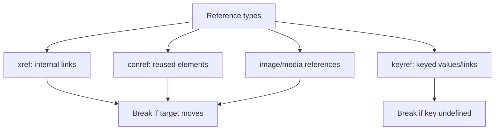

Broken links quietly erode trust and generate support tickets. In a large,
reuse-heavy DITA repository, a single moved file can break references in many
places. AEM Guides can **validate links and references** across the repository so
you find breakage before your readers do. This guide covers how and when.

## What can break

| Reference | Breaks when |
| --- | --- |
| xref (direct) | Target file moves or is renamed |
| conref | Source element id changes or is deleted |
| keyref | Key isn't defined in the map in scope |
| image/media | Asset is moved or missing |

## Running validation

1. Select the **map or folder** to check.
2. Run **link/reference validation**.
3. Review the report: broken xrefs, unresolved conref/keyref, missing media.
4. Fix at the source (correct the path, define the key, restore the asset).
5. Re-run until clean.

A link validation report listing broken references with their source topics.

<strong>Cheapest quality win:</strong> Run link validation before every release. Most publishing failures are simply an unresolved reference you could have caught here.

## Beyond links: content quality checks

- **DITA validity:** the editor enforces it, but validate imported/bulk-edited
  content.
- **Metadata completeness:** missing status or audience weakens filtering and
  reports.
- **Reuse health:** a reuse report shows whether shared sources are intact.
- **Terminology consistency:** keys and a glossary keep terms uniform.

## Build quality gates into your process

| Stage | Gate |
| --- | --- |
| Before review | DITA valid, metadata set |
| Before baseline | Link validation clean |
| Before publish | Re-check links on the baseline |
| Post-publish | Spot-check outputs and search |

## Troubleshooting

- **Report shows many external "broken" links.** They may be temporarily
  unreachable; separate external from internal issues and re-check.
- **Fixed a link but it still reports broken.** You edited the reference, not the
  target; correct the actual target or key definition.
- **keyref reported unresolved.** The deliverable map doesn't reference the key
  map, or the key is undefined; wire it up.
- **conref broken after a move.** Prefer conkeyref for portability; update or
  redefine the source.

## Takeaway

Link and reference validation is your first line of defense against broken content.
Understand what breaks each reference type, run validation as a standard pre-release
gate, and widen the net to metadata and reuse health. Catching issues before
publish turns quality from luck into process.
