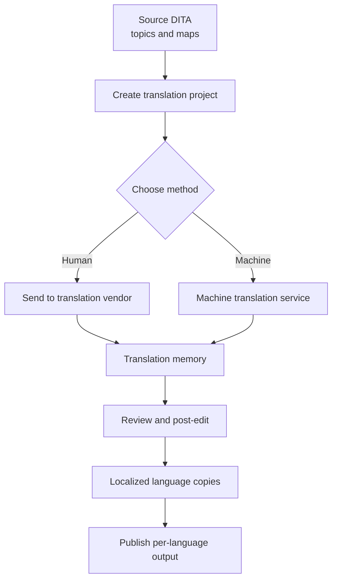

If your documentation serves more than one market, translation stops being a
side task and becomes part of your publishing pipeline. AEM Guides has
translation built in, and because content is structured DITA, you translate
smart, small units instead of whole documents. This guide covers what
translation is, the two ways to do it, and how to configure it for DITA.

## Translation vs. localization

People use these words interchangeably, but they are not the same thing.

- **Translation** converts text from a source language into a target language.
- **Localization** goes further: it adapts content to a locale, including date
  and number formats, units, images, examples, legal text, and tone.

AEM Guides handles the mechanics of both. It manages source and target language
versions of every topic and map, and it keeps them linked so you always know
what is translated, what changed, and what still needs work.

## The translation workflow at a glance

The dotted line matters: because DITA is modular, a re-translation only sends the
topics that changed since last time, not the whole book.

## Two ways to translate: human vs. machine

| Aspect | Human translation | Machine translation |
| --- | --- | --- |
| Quality | Highest; nuance, tone, and context | Good and improving; can miss nuance |
| Speed | Days to weeks | Seconds to minutes |
| Cost | Higher, per word | Low, near-instant |
| Best for | Public docs, legal, marketing | Drafts, internal docs, high-volume, low-risk |
| Typical setup | Vendor connector + translation memory | Cloud MT service (e.g., Microsoft, Google) |

Most mature teams use **both**: machine translation for a fast first pass, then
human post-editing where quality matters. AEM Guides supports this mix per
language and per project.

## Steps: human translation

1. **Select the source** map or topics in the Repository view.
2. **Create a translation project**, choosing "Human Translation".
3. **Pick target languages** from your configured language list.
4. AEM Guides creates language copies and sends the content to your configured
   **translation vendor** through the connector.
5. The vendor translates, aided by **translation memory** so repeated phrases
   stay consistent and cheaper over time.
6. Translated content returns automatically into the matching **language copies**.
7. **Review and approve**, then publish the localized output.

## Steps: machine translation

1. **Select the source** content and **create a translation project**, choosing
   "Machine Translation".
2. **Pick target languages**.
3. AEM Guides sends the content to the configured **machine translation cloud
   service** and returns results in seconds.
4. **Post-edit** the output where accuracy is critical (a human quality pass).
5. **Publish** the localized output.

## Configuring DITA translation

Translation runs on Adobe's **AEM Translation Framework**, plus a few
Guides-specific choices. A typical setup:

1. **Enable languages.** Define your source language and the target languages
   your team supports, usually on the **folder profile** so a content area shares
   one language policy.
2. **Configure a translation provider.** In **Cloud Services → Translation Cloud
   Services**, add either a *human* connector (your vendor) or a *machine*
   service (such as Microsoft or Google), with the required credentials.
3. **Create a translation integration configuration** that maps your provider,
   translation memory, and options (translate vs. do-not-translate rules).
4. **Set DITA translation preferences** in AEM Guides:
   - How to handle **conref and keyref**: translate the resolved value, or keep
     the reference so shared content is translated once at the source.
   - Which **metadata and attributes** to send or protect.
   - Whether to translate **filenames and titles**.
5. **Run a test project** on a small map, verify the language copies resolve, and
   publish one target language before scaling up.

> Configure translation on the folder profile, not per file. One language policy
> for a content area keeps every author and project consistent.

## Best practices

- **Write translation-friendly source.** Short sentences, one idea per topic, and
  consistent terminology all lower cost and raise quality.
- **Reuse before you translate.** A phrase reused via conref is translated once,
  not everywhere it appears.
- **Translate only what changed.** Let the modular workflow re-send just the
  updated topics.
- **Keep a glossary and translation memory.** Consistency across releases is what
  makes localized docs feel native.

## Takeaway

In AEM Guides, translation is a managed, repeatable pipeline rather than a
fire-and-forget export. Decide human vs. machine per audience, configure it once
on the folder profile, and let the structured, modular nature of DITA keep every
re-translation small and every language version in sync.
