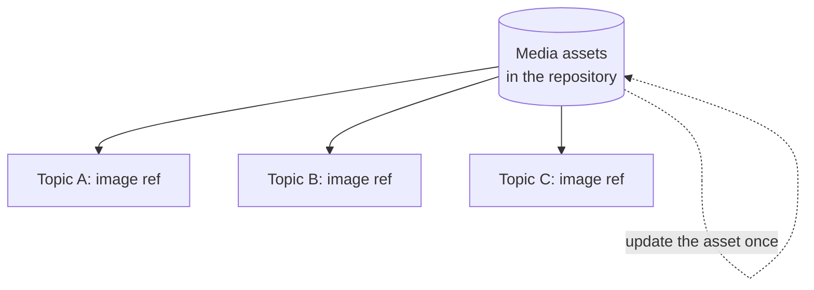

In DITA, images and media are **referenced, not embedded**. That one fact shapes
how you organize, reuse, and maintain visuals in AEM Guides. Handled well, media
stays consistent and accessible across every topic and output; handled poorly, you
get broken images and duplicated files. This guide covers the good habits.

## How DITA references media



A topic points at an asset with an `<image>` element:

```xml
<image href="images/login-screen.png">
  <alt>The login screen with username and password fields.</alt>
</image>
```

Update the source asset and every topic that references it reflects the change.

## Organize assets deliberately

| Approach | Result |
| --- | --- |
| Central `media/` per product | Predictable, easy to reference |
| Images scattered next to topics | Hard to reuse, easy to duplicate |
| Shared `/shared/media` for common visuals | One logo, referenced everywhere |

<div class="shot">A media folder in the Repository view with referenced images and their usage listed.</div>

## Always add alt text

Alt text is not optional. It's essential for **accessibility** and improves SEO for
HTML output. Write it to describe the image's meaning, not just its appearance.

<div class="note"><strong>Accessibility rule:</strong> Every meaningful image needs alt text. Decorative-only images should be marked so assistive tech can skip them.</div>

## Choose the right format

| Format | Best for |
| --- | --- |
| SVG | Diagrams, icons; scales crisply, small |
| PNG | Screenshots with sharp edges/text |
| JPG | Photos and rich images |
| PDF/EPS | Print-oriented vector art (engine dependent) |

Prefer **SVG** for diagrams where supported: it scales without blurring and stays
small.

## Reuse media like content

- Reference one **shared logo** rather than copying it into every product.
- Use **keys** for media that varies by product/edition (`img-logo`), so the same
  topic shows the right image per deliverable.
- Keep a **media library** alongside your content library.

```xml
<keydef keys="product-logo" href="shared/media/logo-pro.svg" format="svg"/>
<image keyref="product-logo"><alt>Product logo</alt></image>
```

## Troubleshooting

- **Image missing in output.** The referenced asset moved or the path is wrong;
  prefer keyref for media that may move, and run link validation.
- **Blurry image in PDF.** Resolution too low for print; use higher-res or SVG for
  diagrams.
- **Same image duplicated everywhere.** Consolidate into a shared asset and
  reference it.
- **Wrong logo in a product's output.** Use a media key redefined per deliverable
  rather than a hard-coded path.
- **Screen reader skips important image.** Missing alt text; add meaningful alt.

## Takeaway

Treat media the way DITA intends: referenced, organized, and reused. Keep assets in
predictable folders, always write alt text, choose SVG for diagrams, and use keys
for media that varies by product. Do that and your visuals stay consistent,
accessible, and maintainable across the whole documentation set.
