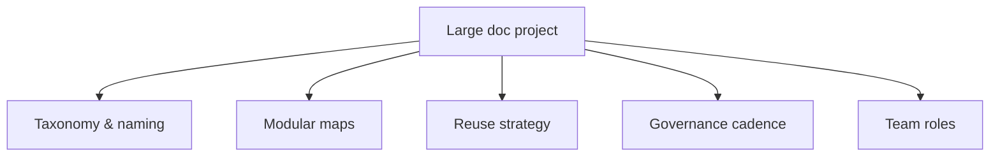

Scale changes everything. Practices that work for one guide fall apart across
thousands of topics, multiple products, several languages, and a growing team.
Managing a large documentation project in AEM Guides is about **standards and
structure** more than heroics. This guide is the playbook.

## The pillars of scale

## 1. Taxonomy and standards

- A clear **folder taxonomy** (per product: topics, maps, media, shared).
- **Naming conventions** for topics, maps, and keys.
- **Controlled metadata** and profiling values via profiles and subject schemes.

Standards are what let many people produce content that still feels like one voice.

## 2. Modular maps

Break big deliverables into **submaps**, keep hierarchy shallow, and separate
reusable library maps from deliverable maps. This lets teams own sections
independently and reduces merge-style conflicts.

| Anti-pattern | Fix |
| --- | --- |
| One giant map | Parent map + section submaps |
| Deep nesting | Flatten; split into submaps |
| Copy-paste across guides | Shared reusable submaps |

## 3. Reuse strategy

Decide, deliberately, what is reused and how: a **library** of shared topics,
warnings, and boilerplate; **keys** for names/versions/links; **conref/conkeyref**
for blocks. A reuse strategy on paper prevents accidental duplication at scale.

<strong>Reuse is a strategy, not an accident.</strong> Name owners for the shared library and key maps, or reuse quietly rots into duplication.

## 4. Governance cadence

| Frequency | Activity |
| --- | --- |
| Continuous | Reviews, versioning, metadata upkeep |
| Weekly | Status reports toward release |
| Per release | Link validation, baseline, publish |
| Quarterly | Reuse and consolidation analysis |

## 5. Team roles and permissions

Model **groups by function** (authors, reviewers, publishers, admins) with
folder-scoped permissions, and onboard by cloning known-good profiles. Clear roles
prevent both bottlenecks and accidents.

A dashboard-style view of a large project: multiple product folders, status, and reuse metrics.

## Troubleshooting scale problems

- **Inconsistent content across teams.** Tighten profiles, metadata schemes, and
  naming standards.
- **Reorg is terrifying.** Monolithic maps; refactor into submaps and use keyref.
- **Duplication creeping in.** Reuse isn't owned; assign owners and run reuse
  reports.
- **Releases are chaotic.** Adopt the label to baseline to publish cadence and
  make link validation a gate.

## Takeaway

Large documentation projects succeed on structure, not effort: a clear taxonomy,
modular maps, an owned reuse strategy, a governance cadence, and role-based teams.
Invest in these standards early and the project scales from one guide to an entire
product line without a rewrite.
