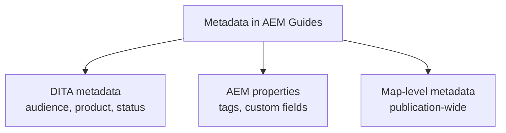

Metadata is the quiet infrastructure of a healthy CCMS. It's what lets you find
content, filter it, report on it, and publish tailored variants. In AEM Guides,
metadata lives at several levels, and using it consistently is what separates a
searchable, governable repository from a folder of files. This guide covers the
what, where, and why.

## Kinds of metadata

| Type | Examples | Drives |
| --- | --- | --- |
| Profiling attributes | audience, product, platform | Conditional publishing |
| Status metadata | draft, in review, approved | Workflow and reports |
| Descriptive | keywords, short description | Search and previews |
| Custom properties | owner, review date, doc ID | Governance and reporting |

## Where to set metadata

- **Topic level:** status, audience, keywords for that unit.
- **Map level:** publication-wide properties (product, edition, release).
- **Folder profile:** defaults and allowed values for a content area.

The properties panel for a topic showing status, audience, and custom metadata fields.

## Make values controlled, not free-text

Free-text metadata drifts (`Approved`, `approved`, `done`). Define controlled
vocabularies (via taxonomy/tags or a subject scheme) so authors choose from a list.
Controlled values are what make search and filtering reliable.

<strong>Principle:</strong> Metadata you can't trust is worse than none. Invest in controlled values early so reports and conditional publishing stay accurate.

## What good metadata unlocks

1. **Search and findability**: keywords and descriptions improve results.
2. **Conditional publishing**: audience/product attributes drive DITAVAL filtering.
3. **Governance reports**: status and owner fields power readiness dashboards.
4. **Reuse discovery**: consistent tagging helps authors find reusable topics.

## Steps to a metadata plan

1. Decide the **few** attributes you truly need (avoid sprawl).
2. Define **controlled values** for each.
3. Apply them via the **folder profile** so a content area shares one policy.
4. Backfill existing content with a bulk metadata operation.
5. Add metadata checks to your review/readiness process.

## Troubleshooting

- **Search misses relevant topics.** Missing keywords/descriptions; backfill them.
- **Filtering behaves inconsistently.** Free-text values crept in; migrate to
  controlled values.
- **Reports look wrong.** Status metadata isn't maintained; make it part of the
  review workflow.
- **Authors skip metadata.** It's optional or hidden; surface required fields in
  the profile.

## Takeaway

Treat metadata as a small, controlled data model applied through folder profiles:
a few meaningful attributes, controlled values, set consistently. That discipline
is what powers search, conditional publishing, and governance across the whole
repository.
