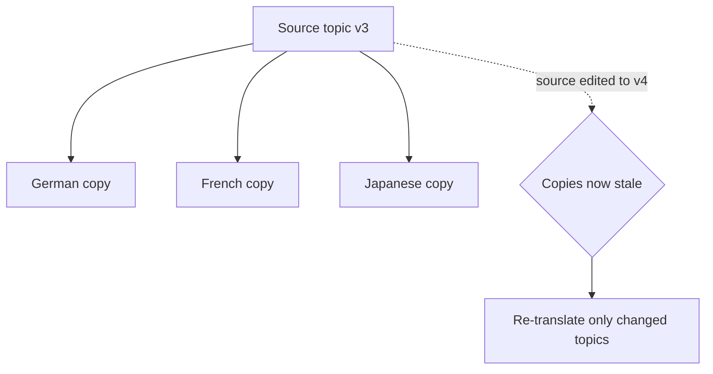

Translating content once is easy; keeping many languages **in sync as the source
evolves** is the real discipline. AEM Guides links each language copy to its
source so you always know what's current, what's stale, and what needs another
pass. This guide covers ongoing localization management.

## Source and language copies

Each language copy knows which **source version** it was translated from. When the
source moves ahead, AEM Guides can tell you which copies are out of date.

## The sync workflow

1. **Author edits** the source (a new version).
2. AEM Guides flags affected **language copies** as out of date.
3. You start a **re-translation** for just those changed topics.
4. Translations return into the language copies.
5. **Validate** each language and publish per-language output.

<strong>The modular payoff:</strong> Only changed topics re-translate. Editing one topic doesn't trigger re-translating the entire book, which is the core cost saver of a DITA CCMS.

## Handling structural changes

| Source change | Effect on translations |
| --- | --- |
| Text edited in a topic | That topic re-translates |
| Topic added to the map | New topic needs translation |
| Topic removed | Language copy should drop it too |
| Topic reordered | Usually no re-translation; map order updates |

A translation status view showing which language copies are current vs out of date.

## Validate before publishing

For each target language, confirm:

- The **map resolves** fully (no missing translated topics).
- **References and keys** resolve in that language.
- Locale specifics (dates, units) look right if you localize, not just translate.

## Steps to a healthy localization cadence

1. Establish a **source freeze** window before each localized release.
2. Run **re-translation on deltas** after the freeze.
3. **Validate** each language's map and links.
4. **Publish** all languages from the same baseline for consistency.

## Troubleshooting

- **Language copy out of sync and won't update.** Start a new translation project
  scoped to the changed topics.
- **Missing topic in a language map.** A topic was added after translation; include
  it in the next project.
- **Broken link only in one language.** A keyref or href resolves differently;
  check that language's key definitions and references.
- **Publish uses mixed versions.** Publish every language from one baseline to keep
  them aligned.

## Takeaway

Managing translations is about keeping language copies in step with an evolving
source. Lean on the source-to-copy linkage, re-translate only deltas, validate each
language's map and links, and publish all languages from one baseline. Modular DITA
makes staying in sync affordable and reliable.
