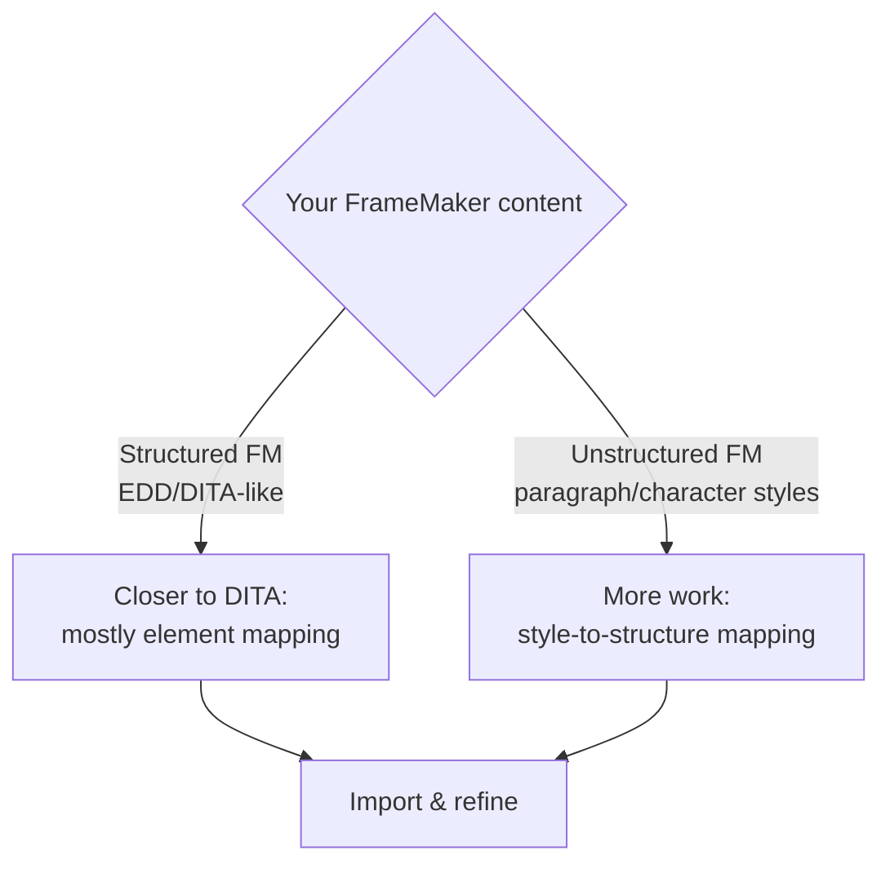

FrameMaker has decades of documentation locked inside it, and moving that into AEM
Guides is as much a content strategy exercise as a technical import. This guide
lays out a realistic migration plan and the decisions that make the difference
between a clean DITA repository and a messy one.

## Two starting points

- **Structured FrameMaker** (EDD-based, especially DITA-flavored) maps to DITA more
  directly.
- **Unstructured FrameMaker** relies on paragraph/character styles that must be
  mapped to DITA structure.

## The migration plan

1. **Inventory and triage.** Catalog documents; decide what to migrate, archive, or
   retire. Do not migrate content you should retire.
2. **Design target DITA.** Decide topic types, map structure, and reuse strategy
   before importing.
3. **Map styles to elements.** Create a mapping from FM styles to DITA elements
   (Heading 1 -> topic title, Note style -> `<note>`, etc.).
4. **Import.** Bring content in, converting toward DITA.
5. **Topic-ize.** Split long documents into standalone topics (this is where real
   value is created).
6. **Clean up.** Remove legacy formatting, fix invalid structures, add ids for
   reuse.
7. **Validate and publish.** Confirm DITA validity and test outputs.

A mapping table aligning FrameMaker paragraph styles to DITA elements before import.

## Mapping example

| FrameMaker style | DITA target |
| --- | --- |
| Heading1 | `<title>` of a new topic |
| Body | `
` |
| Note | `<note>` |
| Step | `<step><cmd>` in a task |
| Table | CALS `<table>` |

<strong>Do not lift-and-shift.</strong> The biggest mistake is importing giant documents as giant topics. Restructure into small, typed topics; that is where reuse, translation, and multi-channel publishing pay off.

## Cleanup that matters

- Convert manual formatting into **semantic elements**.
- Replace copy-paste repetition with **conref**.
- Move product names and versions behind **keys**.
- Add **metadata** for search and conditions.

## Troubleshooting

- **Content imports but won't validate.** Style mapping produced invalid nesting;
  refine the mapping and re-import a sample.
- **Everything is one huge topic.** Topic-ize by heading; each Heading 1 (and often
  Heading 2) becomes its own topic.
- **Images lost or mislinked.** Ensure media is migrated and referenced, with alt
  text added.
- **Cross-references broke.** Rebuild as keyref-based links during cleanup.

## Takeaway

Migrating FrameMaker is a content transformation, not a file copy. Triage first,
design your target DITA, map styles to elements, and above all topic-ize and clean
up. Structured FM is a shorter road than unstructured, but both should arrive as
small, reusable, valid DITA, not as digitized paper.
