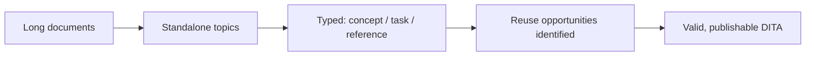

Most teams adopting AEM Guides arrive carrying unstructured content: Word
documents, HTML pages, wiki articles. Moving it into DITA is less about tooling and
more about a shift in thinking, from documents to **topics**. This guide gives a
pragmatic, phased approach.

## The core mindset shift

A 40-page Word document is not one DITA topic; it is many. The migration's value
comes from breaking it into small, typed, reusable units.

## A phased approach

1. **Assess.** Inventory sources; decide what to migrate vs retire. Legacy content
   is a chance to prune.
2. **Model.** Define your target topic types, map structure, and metadata plan.
3. **Pilot.** Migrate one representative document end to end to shake out the
   process.
4. **Convert.** Bring content in and split into topics by heading and intent.
5. **Type.** Classify each topic as concept, task, or reference; restructure to fit.
6. **Reuse.** Identify repeated content and replace copies with conref/keys.
7. **Validate.** Ensure DITA validity, fix links, add metadata, test outputs.

A long Word document on the left, split into several typed DITA topics on the right.

## Convert-then-refine

Automated conversion (Word/HTML to topics) gets you 70% there; the human work is
the refinement:

| Automated | Human refinement |
| --- | --- |
| Paragraphs, lists, tables | Correct topic typing |
| Basic structure | Splitting/merging topics |
| Images carried over | Alt text, sensible references |
| Raw links | keyref-based links |

<strong>Quality gate:</strong> A migrated topic isn't "done" when it validates. It's done when it stands alone, is correctly typed, and reuses shared content instead of duplicating it.

## Reuse discovery

Migration is the perfect moment to find repetition: the same safety notice, the
same setup steps, the same product boilerplate. Extract these into a reuse library
and reference them, so you never migrate the same paragraph twice.

## Troubleshooting

- **Topics are too big.** You migrated documents as topics; split by heading and
  intent.
- **Everything is a generic topic.** Assign real types (concept/task/reference) for
  the structural benefits.
- **Duplicate content everywhere.** Run reuse discovery; replace copies with
  conref.
- **Links are broken or absolute.** Rebuild as keyref-based internal links and
  proper external links.

## Takeaway

Migrating unstructured content is a restructuring project: assess and prune, model
your target, pilot, then convert and refine into small, typed, reusable topics.
Treat conversion as the start, not the finish, and use the migration to build a
cleaner, reuse-driven content set than you had before.
