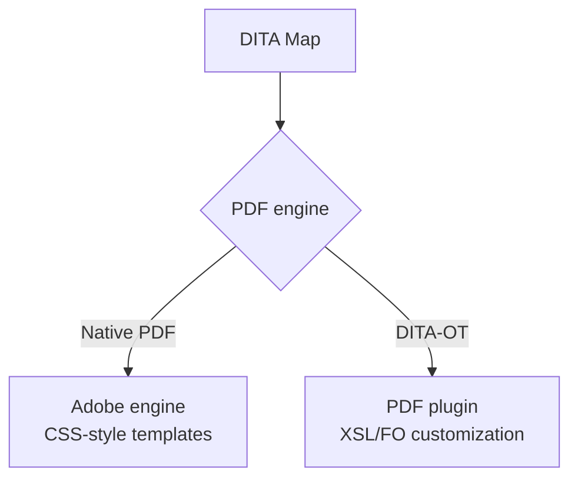

For years, customizing DITA PDFs meant wrestling with XSL/FO. Adobe's **native
PDF** engine in AEM Guides changes that, offering a modern, template-driven
workflow with CSS-like styling. This guide explains what makes it different and
when to choose it.

## Native PDF vs DITA-OT PDF

| Aspect | Native PDF | DITA-OT PDF |
| --- | --- | --- |
| Styling model | CSS-like, visual template editor | XSL/FO customization |
| Iteration speed | Fast | Slower, more technical |
| Design control | High, layout-focused | High, but harder to reach |
| Learning curve | Gentle for designers | Steep (FO expertise) |
| Best for | Brand-heavy, modern PDFs | Established FO-based pipelines |

## What you get

- A **template editor** for covers, headers/footers, page layout, and typography.
- **CSS-style control** that designers can actually work with.
- Faster **design iteration**, so brand changes don't require an FO specialist.
- Strong **fidelity** for complex layouts.

The native PDF template editor with a live-style preview of cover and page layout.

## When to choose native PDF

- You're starting a new PDF workflow and want modern tooling.
- Your brand demands precise, frequently-updated design.
- Your team has design skills but not XSL/FO expertise.

<strong>Note:</strong> Native PDF is specifically about PDF. Other outputs (like HTML5) still flow through the standard pipeline; native PDF is the modern option for the print-grade format.

## Migrating an existing PDF workflow

1. Recreate your brand as a **native PDF template** (cover, running heads,
   typography).
2. Move dynamic values (product, version) behind **keys** so covers/headers stay
   correct across products.
3. Point your PDF **output preset** at the native engine and template.
4. Publish a test document and compare against the old output.
5. Roll out preset by preset, keeping the DITA-OT path available until you're
   confident.

## Troubleshooting

- **Layout differs from the old FO output.** Expected: the engines differ. Tune the
  native template rather than trying to match FO pixel-for-pixel.
- **Fonts not embedding.** Configure brand fonts in the template.
- **Slow generation on huge books.** Publish from a baseline and consider splitting
  very large deliverables via submaps.

## Takeaway

Native PDF brings a modern, designer-friendly, template-driven workflow to DITA
PDF, replacing XSL/FO pain with CSS-like control. Choose it for new or brand-heavy
PDF work, drive dynamic values with keys, and migrate one preset at a time.
