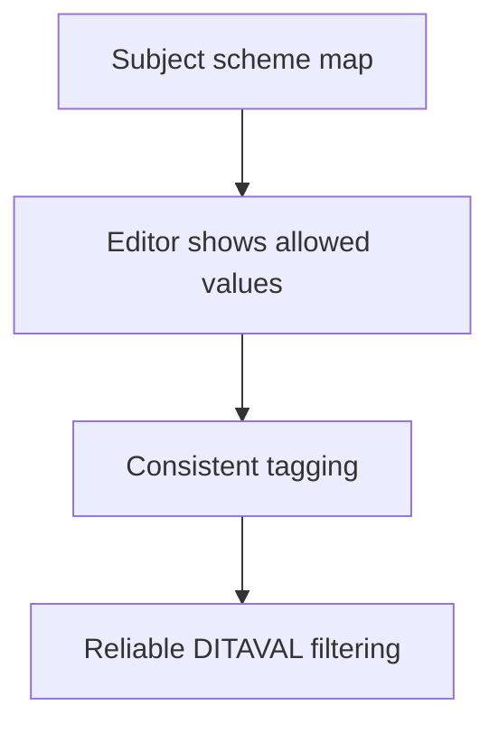

Conditional publishing is only as good as the **profiling** behind it. Profiling
attributes (like `audience`, `product`, `platform`) are what you tag content with
so DITAVAL filtering can produce tailored outputs. This guide is about doing
profiling deliberately, so it stays maintainable as content grows.

## The standard profiling attributes

| Attribute | Typical use |
| --- | --- |
| `audience` | Reader role: admin, user, developer |
| `product` | Edition or product line: lite, pro |
| `platform` | OS or environment: windows, mac, cloud |
| `props` / custom | Anything else you define |

## Define allowed values centrally

The biggest profiling mistake is letting every author invent values (`admin`,
`Admin`, `administrator`). Instead, define a controlled set so authors **choose
from a list**. In DITA this is done with a **subject scheme map**:

```xml
<subjectScheme>
  <enumerationdef>
    <attributedef name="audience"/>
    <subjectdef keys="admin"/>
    <subjectdef keys="user"/>
    <subjectdef keys="developer"/>
  </enumerationdef>
</subjectScheme>
```

Now the editor offers only `admin`, `user`, `developer` for `audience`.



<div class="note"><strong>Why it matters:</strong> Controlled values are what make filtering trustworthy. A single stray value can silently break a variant.</div>

## Tagging strategy

- Tag at the **smallest sensible level**: a phrase, a paragraph, a step, not a
  whole topic when only a sentence differs.
- Prefer **fewer, well-understood attributes** over many overlapping ones.
- Document what each value means so the team tags consistently.

<div class="shot">The Web Editor properties panel showing a controlled list of audience values from a subject scheme.</div>

## Avoiding condition sprawl

Too many attributes and values create a combinatorial mess that's impossible to
test. Keep it lean:

| Symptom | Fix |
| --- | --- |
| Dozens of one-off values | Consolidate into a controlled scheme |
| Overlapping attributes | Merge into one clear attribute |
| Untestable variant count | Reduce dimensions; not every combination needs to ship |

## Profiling and reuse together

Combine profiling with reuse carefully: a conref'd element carries its own tags.
Decide whether the reused source or the referencing context should own the
condition, and be consistent.

## Troubleshooting

- **Filtering misses some content.** Untagged or inconsistently tagged elements;
  audit with a report or search.
- **Editor doesn't restrict values.** The subject scheme isn't applied to the
  profile; wire it into the folder/global profile.
- **A variant is missing content it should have.** An exclude rule plus a broad
  tag; narrow the tag or the DITAVAL.

## Takeaway

Plan profiling like a small data model: a few clear attributes with controlled
values from a subject scheme, tagged at a fine grain and documented for the team.
Do that and conditional publishing stays reliable and testable no matter how large
the content set becomes.
