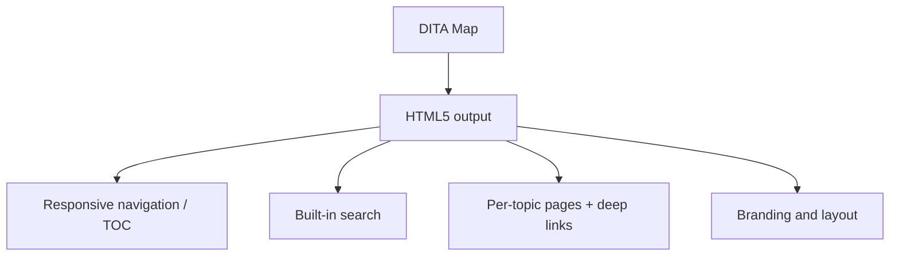

For online help, knowledge bases, and self-service documentation, **responsive
HTML5** is the format that meets readers where they are. AEM Guides generates a
complete, searchable site from your DITA map. This guide covers how to publish it
and how to shape the result.

## What HTML5 output gives you



Out of the box you get a responsive layout, a navigable table of contents,
client-side search, and per-topic pages you can deep-link to.

## Steps to publish

1. Open the **map**.
2. Choose **Generate Output** and select an **HTML5 preset**.
3. Pick the **layout/template** and any **conditions** for filtered variants.
4. Generate, then open or deploy the output to your host.

<div class="shot">A generated HTML5 site: left-hand TOC, search box, and a topic rendered in the content pane.</div>

## Pagination is controlled by chunking

How topics become pages is set by the `chunk` attribute in your map:

```xml
<topicref href="reference.dita" chunk="by-topic">
  <topicref href="param-a.dita"/>
  <topicref href="param-b.dita"/>
</topicref>
```

- `by-topic` gives each topic its own page and URL.
- `to-content` merges a branch into a single page.

<div class="note"><strong>Tip:</strong> Decide chunking with the reader in mind. Reference items usually deserve their own page (good for search and deep links); short sequences read better combined.</div>

## Search and metadata

- Client-side **search** indexes your content automatically; good titles and short
  descriptions improve result quality.
- **Metadata** (audience, product) can drive filtered outputs and better
  findability.

## Customization hooks

| Want to change | Where |
| --- | --- |
| Logo, colors, fonts | HTML5 layout/template settings |
| Header, footer, menu | Layout configuration |
| Search behavior | Output/search settings |
| Which content ships | DITAVAL / condition preset |

Deeper branding is covered in a dedicated custom-layout guide.

## Troubleshooting

- **Search returns nothing.** The index didn't build; regenerate and confirm the
  search feature is enabled in the preset.
- **Broken images or links online.** Relative paths or moved assets; verify media
  references and prefer keyref for links.
- **Pages too long/short.** Adjust `chunk` on the relevant topicrefs.
- **Styles not applied.** The layout/template didn't load; check the preset's
  template selection and deployment paths.

## Takeaway

HTML5 output is the fastest route to a modern, searchable documentation site.
Publish from a preset, control pagination with chunking, lean on search-friendly
titles and metadata, and use the layout settings to brand it. The result feels
like part of your product, not a generic help portal.
