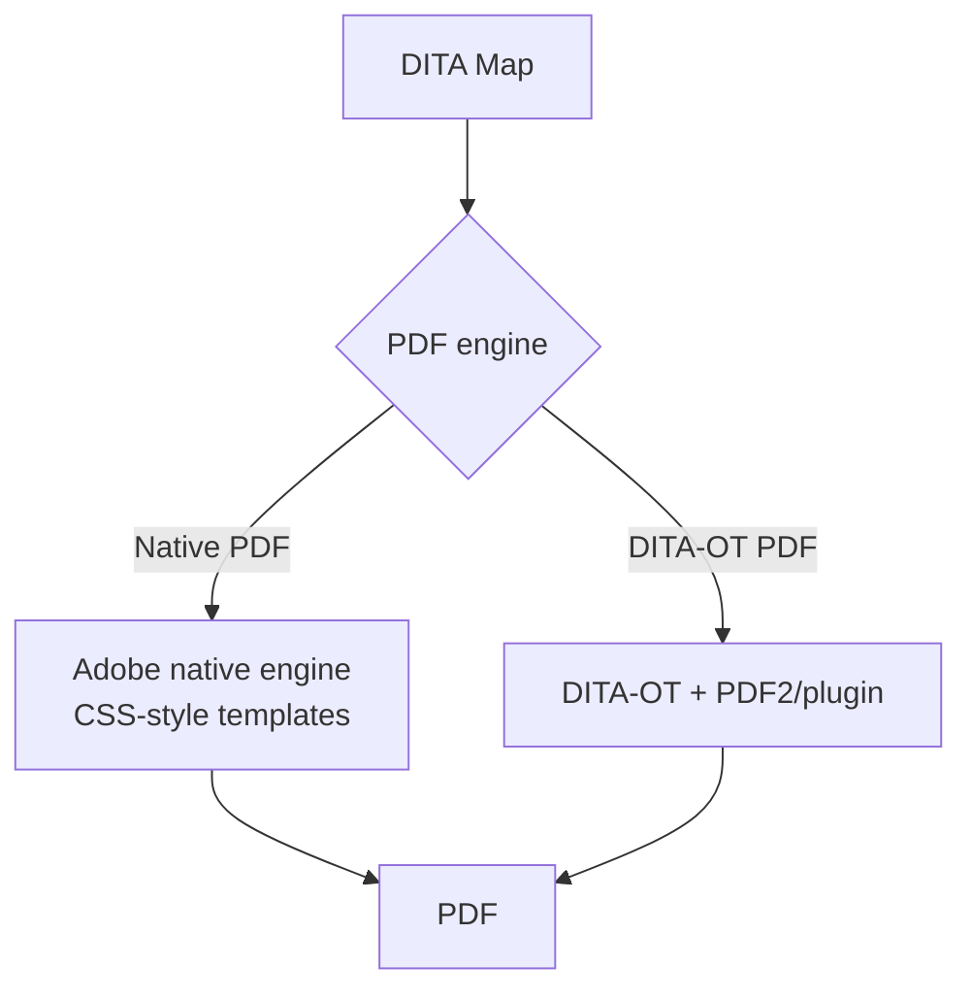

PDF is still the format executives, auditors, and field teams ask for, and AEM
Guides produces it straight from your DITA map. This guide covers the full path:
choosing an engine, configuring a preset, applying templates and conditions, and
troubleshooting the failures that trip people up.

## Two ways to make PDF

- **Native PDF** uses Adobe's own engine with modern, template-driven styling.
- **DITA-OT PDF** uses the open toolkit's PDF transform, familiar to DITA veterans.

Both are valid; native PDF gives designers far more control and faster iteration.

## Steps to publish

1. Open the **map** you want to publish.
2. Choose **Generate Output** (or open the output presets panel).
3. Select a **PDF preset** (native or DITA-OT).
4. Choose a **template**, and a **DITAVAL / condition preset** if you publish
   filtered variants.
5. Optionally publish from a **baseline** for a reproducible snapshot.
6. Run the job and **download** the PDF, or collect it from the configured
   destination.

The Generate Output dialog with a PDF preset, template, and condition selected.

## What a PDF preset controls

| Setting | Effect |
| --- | --- |
| Engine | Native PDF vs DITA-OT |
| Template | Cover, page layout, headers/footers, typography |
| Conditions (DITAVAL) | Which tagged content is included |
| Metadata | Title, author, and document properties |
| Destination | Where the output is stored or delivered |

<strong>Tip:</strong> Configure the preset once and the whole team gets one-click, consistent PDFs. Presets are the difference between repeatable publishing and one-off exports.

## Conditions and baselines

- Apply a **DITAVAL** to include or exclude audience/product content, so one map
  yields several PDFs.
- Publish from a **baseline** when "what we shipped" must stay fixed even as
  authoring continues.

## Troubleshooting PDF failures

- **Job fails immediately.** Usually a broken reference (xref, conref, keyref) or
  invalid DITA. Read the log top-down and fix the first real error.
- **Images missing or low-res.** Check the referenced media exists and is high
  enough resolution for print.
- **Blank or misordered TOC.** The map order or `toc` attributes are off; verify
  the map hierarchy.
- **Fonts look wrong.** The template's fonts aren't available; embed or configure
  the correct fonts.
- **Condition didn't apply.** Confirm the right DITAVAL/condition preset is
  selected in the job.

## Takeaway

Pick native PDF for design control or DITA-OT for classic DITA workflows, wrap
your choices in a reusable preset, and use conditions and baselines for variants
and reproducibility. Once the preset exists, print-grade PDF is a single click for
everyone on the team.
