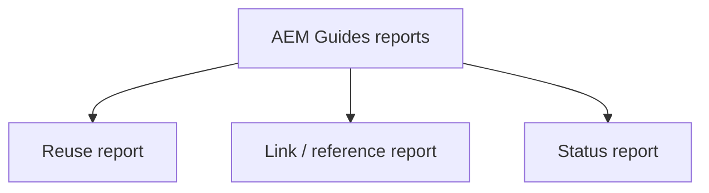

A large repository is only manageable if you can measure it. AEM Guides provides
reports that reveal how content is reused, whether links are healthy, and where each
piece stands in its lifecycle. This guide covers the key reports and, more
importantly, how to act on them.

## The reports that matter

| Report | Answers | Action it drives |
| --- | --- | --- |
| Reuse | Where is this topic/element used? | Safe editing, impact analysis |
| Link / reference | Are references valid? | Fix broken links before release |
| Status | What's draft vs approved? | Release readiness |

## Reuse reports: edit with confidence

Before changing a widely reused topic, a **reuse report** shows every place it
appears. That impact analysis prevents "I fixed one topic and broke five
deliverables" surprises.

A reuse report listing all topics and maps that reference a shared warning.

## Link reports: catch breakage early

A **link/reference report** surfaces broken xrefs, unresolved keys, and missing
media across the repository. Running it before a release is one of the cheapest
quality wins available.

<strong>Habit:</strong> Run link validation and a status check as a standard pre-release gate. Most publishing failures are a broken reference you could have caught here.

## Status reports: know if you're ready

A **status report** aggregates the lifecycle state (draft, in review, approved) of
every topic in a deliverable, turning "are we ready to ship?" from a guess into a
number.

## Turning reports into a rhythm

1. **Weekly:** status report to track progress toward a release.
2. **Before every release:** link report to catch breakage; reuse report before
   editing shared content.
3. **Quarterly:** reuse analysis to find consolidation opportunities.

## Troubleshooting

- **Status looks wrong.** Status metadata isn't maintained; make updating it part
  of the review workflow.
- **Link report is noisy.** Some "broken" links are external and simply
  unreachable at scan time; separate internal from external issues.
- **Reuse report seems incomplete.** It reflects references the system can resolve;
  broken/typo'd references won't show as reuse, they'll show in the link report.

## Takeaway

Reports turn a big repository into something you can actually manage. Use reuse
reports for safe editing, link reports to catch breakage before release, and status
reports for readiness. Build them into a weekly and pre-release rhythm, and quality
becomes measurable instead of hopeful.
