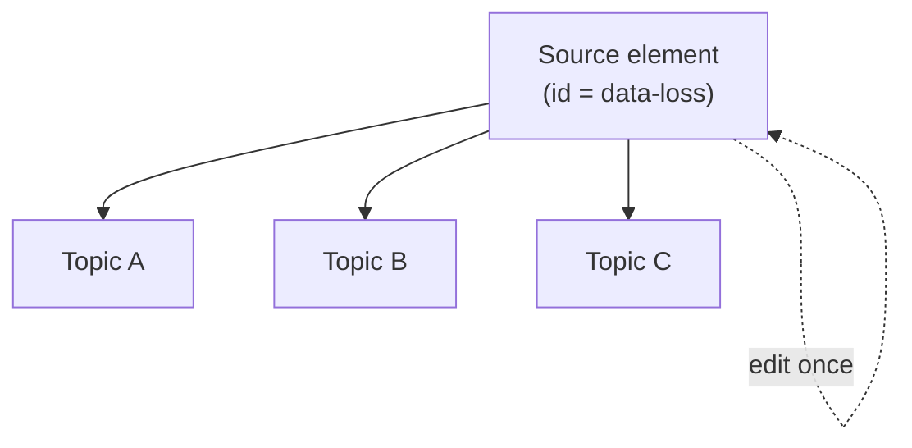

Copy-paste is the quiet enemy of large documentation sets: the same warning drifts
into five slightly different versions, and updating them all is a chore nobody
enjoys. DITA's **content reference (conref)** solves this by letting you write an
element once and pull it into as many topics as you like. This guide goes beyond
the basics into the variants and pitfalls.

## How conref works

You give a source element an **id**, then reference it elsewhere. At publish and
edit time, the reference resolves to the source content.

```xml
<!-- Source topic: warnings.dita -->
<note id="data-loss" type="warning">
  Backing up is irreversible. Verify the target before you continue.
</note>

<!-- Reusing topic -->
<note conref="warnings.dita#warnings/data-loss"/>
```

Update the source once and every reference reflects it.



## conref, conref push, and conkeyref

| Mechanism | Direction | Use it when |
| --- | --- | --- |
| `conref` | Pull source into current topic | The common case: reuse a shared element |
| `conref push` | Push content into a target from elsewhere | You can't edit the target but must inject content |
| `conkeyref` | Reference by key, not path | The source location varies per deliverable |

`conkeyref` combines conref's element reuse with keyref's indirection, so the same
reference can resolve to different sources in different maps.

## What you can conref

- Whole blocks: notes, paragraphs, list items, steps, table rows.
- The rule: the **source element type must match** where you insert it. You can't
  conref a `<step>` into a place that expects a `<p>`.

<div class="note"><strong>Good candidates:</strong> safety warnings, product names and boilerplate, shared prerequisites, repeated steps, and standard legal text.</div>

## A worked example: a reusable prerequisite

```xml
<!-- library/prereqs.dita -->
<task id="prereqs">
  <taskbody>
    <steps>
      <step id="admin-access"><cmd>Ensure you have administrator access.</cmd></step>
    </steps>
  </taskbody>
</task>

<!-- any task that needs it -->
<step conref="library/prereqs.dita#prereqs/admin-access"/>
```

<div class="shot">The Web Editor "Insert Content Reference" dialog browsing to a source element.</div>

## Best practices

- **Keep a reuse library.** A dedicated folder of source topics (warnings,
  prereqs, boilerplate) makes reuse discoverable.
- **Reference, don't fork.** If you need a slight variant, consider conditions
  rather than a separate copy.
- **Prefer conkeyref for portability** when the same content ships in multiple
  products.

## Troubleshooting

- **Broken conref after a move.** Direct conref uses a path; moving the source
  breaks it. Use conkeyref, or update references (search and replace helps).
- **"Element not allowed here."** The source type doesn't match the target
  location. Reuse a matching element type.
- **Edited the reference, nothing changed.** You edited the resolved copy, not the
  source. Open and edit the source element.
- **Circular reference.** A conref that points back to itself won't resolve; break
  the loop.

## Takeaway

conref turns repetition into a single source of truth. Learn the three variants
(conref, conref push, conkeyref), keep a tidy reuse library, and prefer key-based
references for portability. Your warnings and boilerplate will never drift again.
