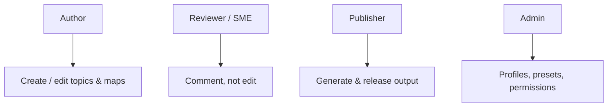
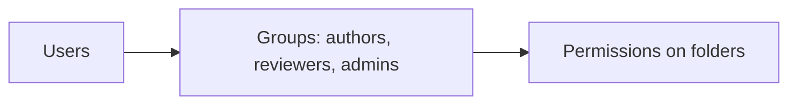

A CCMS holds valuable, sometimes sensitive content, worked on by many people with
different jobs. **Role-based permissions** ensure each person can do their work and
nothing they shouldn't. AEM Guides inherits AEM's robust permission model. This
guide maps it to real documentation roles.

## Typical roles

| Role | Grant |
| --- | --- |
| Author | Read/write on their content folders |
| Reviewer / SME | Read + comment in reviews |
| Publisher | Run output/publish jobs |
| Translator / LTM | Access to translation projects and language copies |
| Admin | Configure profiles, presets, DITA-OT, permissions |

## Use groups, not individual grants

Assign permissions to **groups**, then add people to groups. When someone joins or
leaves, you change group membership, not dozens of individual ACLs.

<strong>Best practice:</strong> Model groups on job function and grant them folder-scoped access. Never hand out admin to make a permission problem "go away".

## Scope access to folders

Grant access at the **folder** level that matches ownership: Product A's authors
get write on Product A's folders, read elsewhere as appropriate. This keeps teams
from stepping on each other and limits blast radius.

The permissions view showing a group with read/write on one product's content folder.

## Least privilege in practice

1. Start from **no access**, add what each group needs.
2. Separate **comment** (reviewers) from **edit** (authors).
3. Restrict **publish** to those responsible for releases.
4. Keep **admin** small and audited.
5. Review group membership periodically.

## Troubleshooting

- **User can't edit their content.** Their group lacks write on that folder; adjust
  the group ACL, not the user.
- **Reviewer accidentally edited content.** They have write where they should only
  comment; tighten the role.
- **Too many admins.** Scope down; most tasks need author/publisher, not admin.
- **Access inconsistent across products.** Model groups per function and apply the
  same pattern to each product's folders.

## Takeaway

Map documentation jobs to roles, implement them as groups with folder-scoped
permissions, and apply least privilege: comment for reviewers, edit for authors,
publish for release owners, admin for the few. It keeps content safe and workflows
clean as the team scales.
