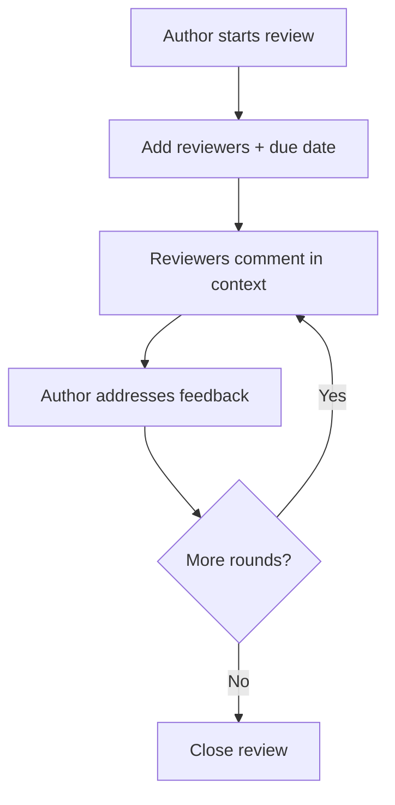

Reviews are where documentation quality is won or lost, and email-and-PDF markups
are where it goes to die. AEM Guides has a built-in **review workflow** that lets
subject-matter experts comment on content in context, in the browser, with
everything tracked. This guide walks the workflow end to end.

## The review loop

## Roles in a review

| Role | Can do |
| --- | --- |
| Author / initiator | Start the review, choose content and reviewers, resolve comments |
| Reviewer / SME | Read and comment in context; usually cannot edit content |
| Approver (optional) | Sign off that content is ready |

Separating "comment" from "edit" keeps the source clean: reviewers suggest, the
author decides.

## Steps to run one

1. Select the **topics or map** to review.
2. **Start a review**, add reviewers, and set a due date.
3. Reviewers open the review and **annotate** specific text with comments.
4. The author works through comments, **replying** and making edits.
5. Resolve each thread; start another round if needed.
6. **Close** the review when everything is addressed.

A review in progress: highlighted text with a threaded comment from a reviewer.

<strong>Why in-context matters:</strong> Comments attached to the exact text remove ambiguity. No more "page 12, second paragraph, third sentence" in an email.

## Getting quality feedback

- Give reviewers a clear **scope and deadline**.
- Ask for **specific, actionable** comments, not vague reactions.
- Use **threads** to resolve discussion in place.
- Track **status** so nothing slips through unresolved.

## Reviews and versioning

Closing a review naturally leads into labeling the approved versions and building a
baseline for the release. The review workflow and version control work hand in
hand.

## Troubleshooting

- **Reviewer can't comment.** Check their permission/role for the review.
- **Comments feel lost.** Use the review's comment list to track open vs resolved
  threads.
- **Edits during review confuse reviewers.** Agree on whether the author edits live
  or after each round; be consistent.
- **Review scope too big.** Break large maps into smaller review units so feedback
  stays focused.

## Takeaway

The built-in review workflow turns feedback into a single, trackable, in-context
conversation. Scope it, invite the right SMEs, collect actionable comments, resolve
threads, and close the loop, then label and baseline the approved result. It's how
quality becomes a process instead of a scramble.
