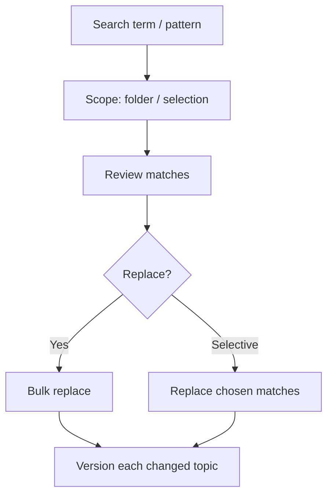

When a product is renamed or a recurring error needs fixing, opening hundreds of
topics by hand is a non-starter. AEM Guides offers **search and replace across the
repository**, turning hours of manual edits into a single, reviewable operation.
This guide shows how to use it safely.

## What it can do

| Use case | Example |
| --- | --- |
| Product/feature rename | "Acme Classic" to "Acme Cloud" |
| Fix a recurring typo | "recieve" to "receive" |
| Terminology alignment | "log on" to "sign in" |
| Locate before editing | find every use of a phrase |

## Steps for a safe replace

1. **Search first, replace never (yet).** Run the search and review every match.
2. **Scope it.** Limit to a folder or selection so you don't touch unrelated
   content.
3. **Inspect matches** for false positives (a term inside a code sample or a
   different context).
4. **Replace**, ideally selectively where context varies.
5. **Review the changes** and the versions created, so you can revert if needed.

A repository search results panel with matches listed and a replace field.

<strong>Safety first:</strong> A blind repository-wide replace can corrupt content inside code samples, keys, or attributes. Always review matches, and prefer scoped, selective replacement.

## When to use keys instead

If you find yourself repeatedly renaming the same value (a product name, a URL),
that value should live behind a **key**. Then the next rename is one keydef edit,
not a repository search. Search and replace is for one-off corrections; keys are
for values that change.

## Steps to avoid regret

1. **Back yourself with versioning:** every changed topic gets a version, so you
   can revert.
2. **Do a dry run** on a small scope first.
3. **Exclude code/verbatim** contexts where a replace would be wrong.
4. **Communicate** big changes so reviewers expect them.

## Troubleshooting

- **Replaced too much.** Revert the affected topics via version history and redo
  with a tighter scope or selective replacement.
- **Missed some matches.** Check case sensitivity and whether the term appears via
  a key (which won't show as literal text).
- **Broke a code sample.** Exclude verbatim/code contexts; fix the affected topic
  and re-run more carefully.
- **Same rename keeps recurring.** Move the value behind a key so it's a single
  future edit.

## Takeaway

Repository-wide search and replace is a huge time-saver when used carefully: search
and review first, scope tightly, replace selectively, and rely on versioning as
your undo. For values that change often, promote them to keys so the next change is
a one-liner rather than a hunt.
