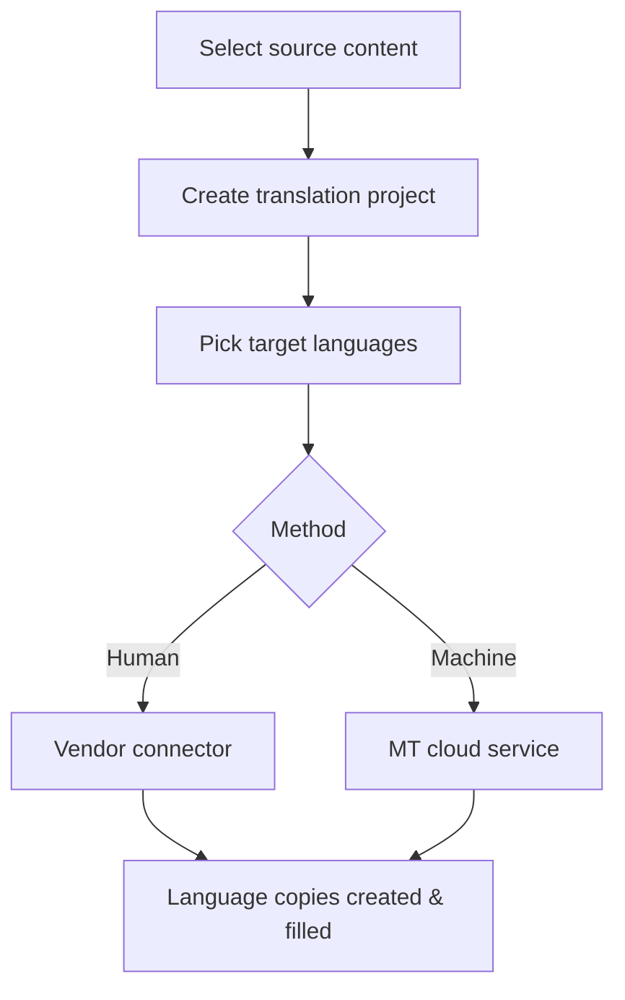

Once translation is configured, the day-to-day act is **starting a translation
project**: choosing what to translate, into which languages, by which method. This
guide focuses on that operation and the choices that affect cost and quality. For
the full picture see the complete translation guide.

## What a translation project does

A project creates **language copies** of your selected content and routes the
source to the chosen provider, returning translations into those copies.

## Steps

1. In the Repository view, **select the map or topics** to translate.
2. **Create a translation project** and name it clearly (include the release).
3. Choose the **method**: human, machine, or a mix per language.
4. Select **target languages** from your configured list.
5. Submit. AEM Guides creates language copies and sends content to the provider.
6. Track progress in the project until translations return.

The Create Translation Project dialog with target languages and method selected.

## Human, machine, or both

| Choose | When |
| --- | --- |
| Human | Public, legal, or brand-critical content |
| Machine | Drafts, internal, high-volume, low-risk |
| Both | MT first pass, human post-edit where it matters |

<strong>Tip:</strong> Decide method per language and content type. High-traffic customer docs may warrant human translation; internal runbooks may be fine with machine.

## References and reuse during a project

Because content is modular, a project only needs the topics you selected. Shared
elements reused via conref/keyref are translated **once at the source**, so you're
not paying to translate the same warning ten times. Confirm your translation
preferences handle references the way you expect before a big run.

## Steps to keep cost down

1. **Reuse before translating**, so shared text is translated once.
2. **Send only changed topics** on re-translation.
3. Use a **translation memory** so repeated phrases aren't re-charged.
4. **Batch** related content into one project rather than many tiny ones.

## Troubleshooting

- **Project stuck / not returning.** Check the provider connection and credentials
  in the translation cloud service config.
- **A language copy is empty.** The source wasn't included, or the target language
  wasn't selected; recreate with the correct scope.
- **Too much sent for translation.** You selected a whole map when only a few
  topics changed; select the changed topics.
- **References translated unexpectedly.** Review your DITA translation preferences
  for conref/keyref handling.

## Takeaway

Starting a translation project is: select content, name it, pick method and
languages, submit. Reuse first, send only what changed, and choose human vs machine
per content type. That keeps translation fast, consistent, and affordable.
