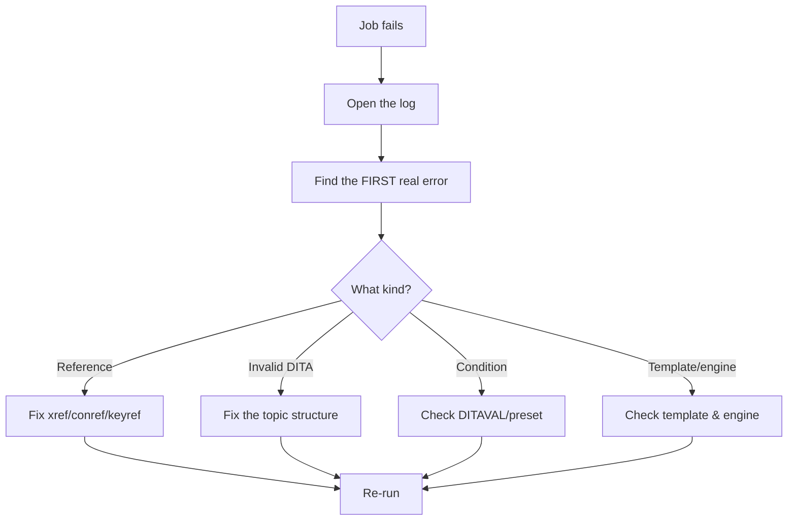

A failed publish job on release day is stressful, but the causes are usually a
short, familiar list. This guide gives you a calm, systematic way to diagnose and
fix AEM Guides publishing failures instead of guessing.

## The diagnostic flow

## Rule one: read the log top-down

Publishing logs can be long and scary, but the **first real error** is almost
always the cause. Later errors are often cascades from it. Find that first error
before changing anything.

## The usual culprits

| Symptom | Likely cause | Fix |
| --- | --- | --- |
| Fails instantly | Broken reference or invalid DITA | Validate links; fix the topic |
| Missing/low-res images | Asset missing or too small | Restore/replace media |
| Empty or wrong TOC | Map order / `toc` attributes | Fix the map hierarchy |
| Wrong content included | DITAVAL/condition mismatch | Check the preset's condition |
| Fonts wrong in PDF | Template fonts unavailable | Embed/configure fonts |
| Times out on huge book | Sheer size | Publish from baseline; split via submaps |

A publishing log with the first error highlighted near the top of the output.

## Engine-specific checks

- **Native PDF:** verify the template and its fonts; confirm the preset uses the
  native engine.
- **DITA-OT:** a custom DITA-OT or plugin may be misregistered; check the toolkit
  setup and its own log.
- **HTML5:** confirm the layout/template loads and the search index builds.

<strong>Isolate the cause:</strong> If a full map won't publish, try publishing a single known-good topic, then a small submap. The point where it breaks tells you where the problem lives.

## A repeatable recovery process

1. **Reproduce** with the same preset and (if used) baseline.
2. **Read** the log for the first error.
3. **Isolate**: publish a small subset to narrow it down.
4. **Fix** at the source (reference, DITA, condition, template).
5. **Re-run** and confirm; then re-run the full job.

## Troubleshooting the troubleshooting

- **Log is unclear.** Increase verbosity if available, or isolate by publishing
  smaller pieces.
- **Works for one output, fails for another.** The issue is engine/template
  specific, not the content.
- **Intermittent failures.** Often resource/timeout on large jobs; baseline and
  split.
- **Passed validation but still fails.** A condition or template issue, not a
  reference; check the preset.

## Takeaway

Publishing failures are rarely mysterious. Read the log top-down for the first real
error, match it to the usual culprits, isolate by publishing smaller pieces, fix at
the source, and re-run. A calm, systematic pass beats frantic guessing every time.
