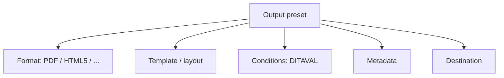

Publishing consistency doesn't come from discipline alone; it comes from
**output presets**. A preset bundles every decision a publish job needs into one
reusable profile, so anyone can reproduce a deliverable with a click. This guide
explains what presets hold, where they live, and how to design a set that scales.

## What a preset bundles

| Element | What it decides |
| --- | --- |
| Format | The output type (native PDF, DITA-OT PDF, HTML5, and more) |
| Template/layout | Look and feel of the output |
| Conditions | Which tagged content is included (audience/product) |
| Metadata | Document properties applied to the output |
| Destination | Where generated output is stored or delivered |

## Global vs map-level presets

- **Global presets** are defined centrally and available across content.
- **Map-level presets** are attached to a specific map for deliverables with
  particular needs.

Define shared defaults globally, then override at the map level only where a
deliverable genuinely differs.

The output presets panel listing PDF and HTML5 presets with their templates and conditions.

## Design a preset set that scales

A practical pattern for a product with editions and audiences:

| Preset | Format | Condition |
| --- | --- | --- |
| Admin Guide (PDF) | Native PDF | audience = admin |
| User Guide (PDF) | Native PDF | audience = user |
| Online Help | HTML5 | all |
| Pro Edition (PDF) | Native PDF | product = pro |

<strong>Principle:</strong> One preset per real deliverable. If you find yourself hand-tweaking settings at publish time, that variation belongs in a preset.

## Presets, conditions, and baselines together

- **Conditions** in a preset produce audience/product variants from one source.
- Publishing a preset **from a baseline** locks the exact content versions,
  making a release reproducible months later.

## Troubleshooting

- **Two people get different output.** They used different presets or ad-hoc
  settings. Standardize on named presets.
- **Wrong content included.** The preset's condition (DITAVAL) is off; check the
  selected condition preset.
- **Output lands in the wrong place.** The destination in the preset is
  misconfigured.
- **Template changes not reflected.** The preset points at an older template
  version; update the preset.

## Takeaway

Presets turn publishing from a fiddly, error-prone task into a one-click,
repeatable action. Bundle format, template, conditions, metadata, and destination
into one preset per deliverable, keep shared defaults global, and pair presets
with baselines for reproducible releases.
