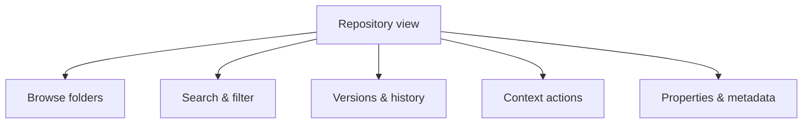

The **Repository view** is your file system for content in AEM Guides: where you
browse folders, find topics and maps, see versions, and launch actions. A little
structure and a few habits here make everything else in the tool faster. This
guide covers how to use it well.

## What the Repository view gives you

## Design a folder taxonomy

A predictable structure is the single biggest productivity win:

| Folder pattern | Holds |
| --- | --- |
| `/product-a/topics` | Authored topics for Product A |
| `/product-a/maps` | Deliverable and submaps |
| `/product-a/media` | Images and assets |
| `/shared/library` | Reusable topics, warnings, boilerplate |
| `/shared/keydefs` | Key-definition maps |

<strong>Convention over chaos:</strong> Agree on folder structure and naming before the repository grows. Retrofitting a taxonomy onto thousands of files is painful.

## Find content fast

- **Search** by title, content, or metadata.
- **Filter** by type (topic vs map), status, or tags.
- Save yourself clicks by navigating with search rather than deep folder clicking.

The Repository view with a folder tree, a filtered file list, and the properties panel.

## Context actions

Right-click (or use the action menu) on a file or folder to:

- Create versions, add labels, view history.
- Move, copy, or delete.
- View references (where it's used) and properties.
- Start reviews, translation, or publishing.

Acting from the Repository view keeps you in one place instead of hopping between
screens.

## Habits that keep it tidy

1. **Name descriptively** and lowercase; avoid spaces.
2. **Separate reusable content** into a shared library folder.
3. **Keep media near** the content that uses it, or in a clear assets folder.
4. **Archive** retired content instead of leaving it to clutter search.

## Troubleshooting

- **Can't find a topic.** Use search by metadata or content, not just folder
  browsing; check you have read access.
- **Moved a file, links broke.** Prefer keyref; run link validation after moves.
- **Repository feels cluttered.** Introduce or enforce a taxonomy; archive retired
  content.
- **Duplicate-looking files.** Consolidate into a shared library and reference
  them.

## Takeaway

Treat the Repository view as the control center it is: design a clear folder
taxonomy, find content by search and filter, act via context menus, and keep it
tidy with naming and archiving habits. A well-organized repository makes authoring,
reuse, and publishing dramatically smoother.
