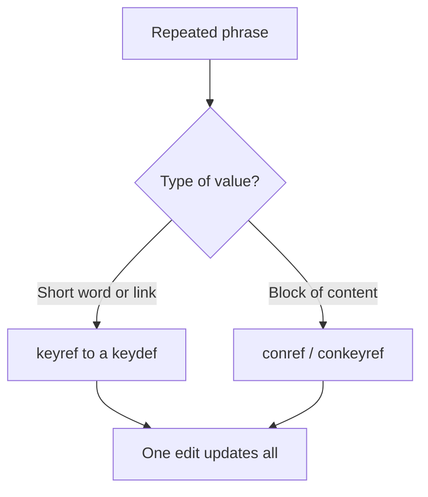

Every documentation set has phrases that repeat everywhere: the product name, the
current version, a company name, a UI label. Hard-coding them means a rebrand or
version bump turns into a repository-wide find-and-pray. DITA gives you two clean
ways to handle these "variables" so one edit updates everything.

## Two techniques, one goal



- **keyref** is best for short values: names, versions, labels, URLs.
- **conref / conkeyref** is best for larger reused blocks: a standard note, a
  paragraph, a set of steps.

## Variables with keyref

Define once:

```xml
<keydef keys="product-name">
  <topicmeta><keywords><keyword>Acme Cloud</keyword></keywords></topicmeta>
</keydef>
<keydef keys="release"><topicmeta><keywords><keyword>2025.3</keyword></keywords></topicmeta></keydef>
```

Use anywhere:

```xml
<p><keyword keyref="product-name"/> version <keyword keyref="release"/>
introduces native PDF publishing.</p>
```

Rebrand or bump the version by editing two keydefs.

## Reusable phrases and blocks with conref

For anything longer than a word, reuse the element itself:

```xml
<!-- library/phrases.dita -->
<p id="trademark">Acme and the Acme logo are trademarks of Acme Inc.</p>

<!-- anywhere -->
<p conref="library/phrases.dita#phrases/trademark"/>
```

<div class="note"><strong>Rule:</strong> Words and links go behind keys; sentences and blocks go behind conref. Both give you a single source of truth.</div>

## Build a variables library

Keep a small, well-known set of source files:

| File | Holds |
| --- | --- |
| `keydefs.ditamap` | Product name, versions, URLs, UI labels |
| `library/phrases.dita` | Trademark, boilerplate, standard notes |
| `library/prereqs.dita` | Reusable prerequisite steps |

Everyone references these; nobody retypes them.

<div class="shot">A variables/keydefs map alongside a phrases library topic in the Repository view.</div>

## Translation bonus

Variables shine in localization: a phrase reused via conref or a key is
**translated once at the source**, not everywhere it appears, which cuts cost and
guarantees consistency across languages.

## Troubleshooting

- **Version updated in the keydef but not in output.** Confirm the deliverable map
  references the correct key map and re-generate.
- **Phrase reads oddly mid-sentence.** Variables inside sentences can create
  grammar issues across languages; keep variable phrases self-contained where
  possible.
- **Two different values for the same concept.** Someone hard-coded it instead of
  using the key. Search and replace, then point it at the key.

## Takeaway

Treat product names, versions, and repeated phrases as managed variables: keys for
short values, conref for blocks. Maintain a small variables library everyone uses,
and a rebrand or release bump becomes a one-line change instead of a migration.
