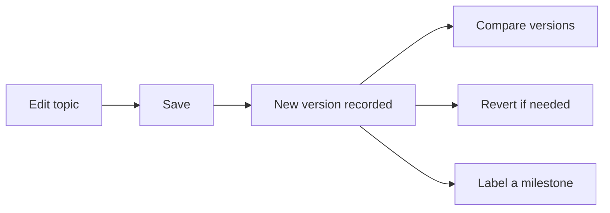

Versioning is your safety net and your audit trail. In AEM Guides every topic and
map carries a history, so you can see what changed, compare revisions, revert
mistakes, and pin exact versions for a release. This guide explains how versioning
works and how to use it well.

## How versioning works

Each meaningful save creates a version. AEM's model supports **major and minor**
versions so you can distinguish routine edits from significant milestones.

| Concept | Meaning |
| --- | --- |
| Minor version | Routine incremental save |
| Major version | A significant, milestone revision |
| Label | A human-friendly name on a version |
| Revision history | The full timeline of a topic or map |

## Comparing and reverting

- **Compare** two versions to see exactly what changed (useful for reviews and
  audits).
- **Revert** to an earlier version when an edit went wrong. The revert itself is
  recorded, so nothing is lost.

The version history panel for a topic, comparing two revisions side by side.

## Labels turn history into milestones

A long list of versions is hard to navigate. **Labels** (like "v2.0 approved") mark
the versions that matter, and they're what you build baselines from.

<strong>Habit:</strong> Save deliberately at milestones and label the important ones. A history full of unlabeled autosaves is hard to use; a few clear labels make it navigable.

## Versioning underpins releases

Versioning is the foundation for two release features:

- **Baselines** capture specific versions of every topic in a map for reproducible
  publishing.
- **Labels** let a baseline select "the approved versions" precisely.

## Steps for a clean versioning practice

1. Save minor versions freely as you work.
2. Promote to a **major version** at meaningful milestones.
3. **Label** approved or released versions.
4. Build a **baseline** from labeled versions for each release.
5. Use **compare** during reviews to focus on what actually changed.

## Troubleshooting

- **Too many meaningless versions.** Encourage deliberate saves and use labels to
  mark the ones that matter.
- **Can't tell what changed.** Use compare; if diffs are huge, topics may be too
  large (favor smaller topics).
- **Reverted and lost recent work.** The revert is itself a version; roll forward
  by reverting to the newer version.
- **Baseline picked the wrong version.** It selected an unlabeled/latest version;
  label the intended ones first.

## Takeaway

Versioning gives you a complete, revertible history of every topic and map. Save
deliberately, promote major milestones, and label approved versions. Those labels
and versions then feed baselines, giving you reproducible, auditable releases.
