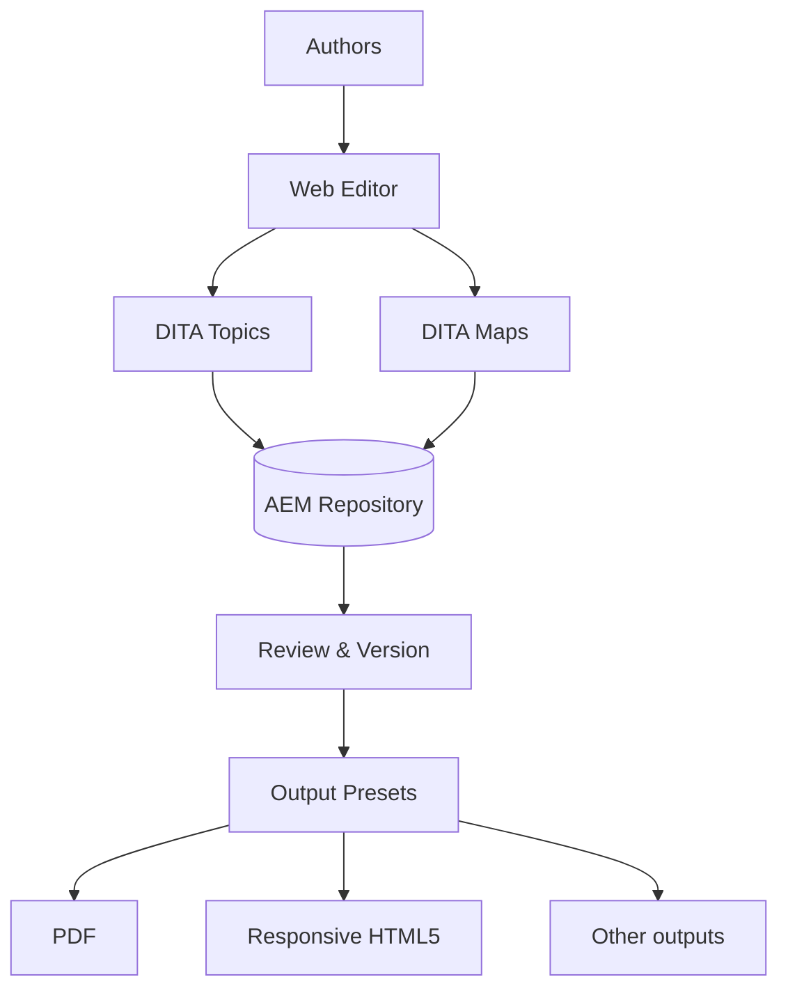

Adobe Experience Manager Guides (AEM Guides) is a native, DITA-based **Component
Content Management System (CCMS)** built directly on top of Adobe Experience
Manager. If you produce large volumes of technical content, product
documentation, knowledge bases, policies, or learning material, it gives you a
single place to author in structured DITA, manage it with real governance, and
publish it to many channels from one source.

This overview gives you the mental model before you touch a single topic.

## Why structured content, and why a CCMS?

Traditional documents (Word, unstructured FrameMaker, wikis) mix content with
formatting and encourage copy-paste. That works until you have hundreds of pages,
multiple products, and several languages. Then every change becomes risky and
slow.

A CCMS flips the model:

- Content is broken into small, reusable **topics**.
- Formatting is applied at **publish time**, not while writing.
- The same source publishes to **PDF, HTML5, and more**.
- Reuse, versioning, review, and translation are first-class features.

## How the pieces fit together



- **DITA topics** are the smallest units of content (a concept, a task, a
  reference).
- **DITA maps** assemble topics into a deliverable and define order and hierarchy.
- The **AEM repository** stores everything with versioning and metadata.
- **Output presets** turn a map into finished deliverables.

<div class="shot">The AEM Guides home dashboard, showing the Repository, Editor, and Output options.</div>

## Who uses it, and for what

| Role | What they do in AEM Guides |
| --- | --- |
| Technical writer / author | Create and edit topics and maps in the Web Editor |
| Information architect | Design map structure, reuse strategy, and metadata |
| Reviewer / SME | Comment on content in context through the review workflow |
| Localization manager | Run translation projects and manage language copies |
| Admin / DevOps | Configure profiles, output presets, DITA-OT, and permissions |

## A typical content lifecycle

1. **Author** topics in the Web Editor and assemble them in a map.
2. **Reuse** shared content with references instead of copy-paste.
3. **Review** with SMEs directly in the browser.
4. **Version and baseline** to lock a release.
5. **Translate** into target languages (only changed topics re-translate).
6. **Publish** to PDF, HTML5, and other formats from output presets.

## A tiny taste of DITA

A concept topic is just clean, semantic XML. You rarely hand-write it (the editor
does), but seeing it demystifies the whole thing:

```xml
<concept id="what-is-aem-guides">
  <title>What is AEM Guides?</title>
  <conbody>
    <p>AEM Guides is a native DITA CCMS built on Adobe Experience Manager.</p>
  </conbody>
</concept>
```

<div class="note"><strong>Tip:</strong> You do not need to be an XML expert to use AEM Guides. The Web Editor keeps the markup valid while you focus on writing.</div>

## Common questions

- **Is it the same as AEM Sites?** No. Sites is for web experiences; Guides is for
  structured technical content. They can work together, but they solve different
  problems.
- **Do I have to know DITA first?** A little helps, but you can learn the basics
  (topics, maps, reuse) as you go.
- **Cloud or on-premise?** AEM Guides is available on AEM as a Cloud Service and
  on AEM Managed Services / on-prem, with the Cloud Service being Adobe's forward
  direction.

## Takeaway

AEM Guides brings structured authoring, reuse, governance, translation, and
multi-channel publishing into one platform built on AEM. Learn three words to
start (topic, map, reuse) and the rest of the platform will make sense as you
grow into it.
