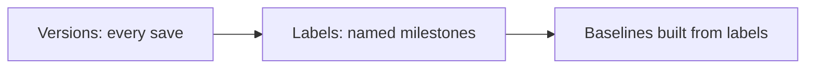

A topic might have dozens of versions, most of them routine saves. **Labels** are
how you mark the few that matter: "approved", "v2.0 GA", "sent for translation".
This short guide covers how labels relate to versions and how to use them to make
releases and baselines effortless.

## Labels vs versions

| | Version | Label |
| --- | --- | --- |
| Created | On save | Manually, on purpose |
| Meaning | A point in history | A milestone you named |
| Use | Compare, revert | Select for release/baseline |

Versions accumulate automatically; labels are curated by you.

## A simple labeling strategy

- **Release labels:** `v2.0-GA`, `v2.1-GA`.
- **Status labels:** `approved`, `sme-reviewed`.
- **Process labels:** `sent-for-translation`, `legal-cleared`.

Apply labels consistently across the topics in a deliverable so you can select them
as a set.

The version history with a label applied to a specific version of a topic.

<strong>Tip:</strong> Label at the map/release level of thinking, not per random edit. A handful of meaningful labels beats hundreds of noisy ones.

## Labels drive baselines

The cleanest way to create a reproducible release is:

1. **Label** the approved version of every topic in the map.
2. **Create a baseline** from those labels.
3. **Publish** from the baseline.

Now the release is frozen and repeatable, and the labels document exactly what went
into it.

## Steps to apply a label

1. Open a topic (or select many for a bulk action).
2. In version history, choose **Add Label**.
3. Use a **consistent, dated name**.
4. Repeat across the deliverable, or apply in bulk where supported.

## Troubleshooting

- **Baseline grabbed the wrong version.** The intended version wasn't labeled;
  label it and recreate the baseline.
- **Labels are inconsistent across topics.** Agree on a naming convention and
  apply it as a set per release.
- **Too many labels to make sense of.** Reserve labels for milestones; use plain
  versions for routine saves.

## Takeaway

Labels convert a noisy version history into a set of meaningful checkpoints. Adopt
a small, consistent labeling scheme, apply it per release across the deliverable,
and use those labels to build reproducible baselines. Your release process becomes
clear, selectable, and auditable.
